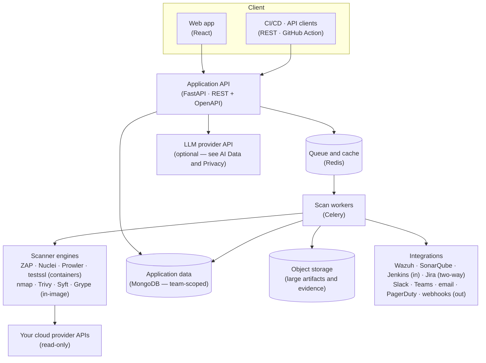
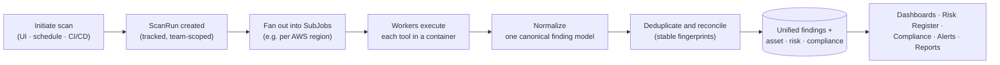

# Platform Architecture

This page explains how Offload Security is put together — the components, how a scan actually executes, where data lives, and how the SaaS and on-premises deployments differ. It complements the conceptual **[Data Lake & Single Pane of Glass](./introduction/unified-data-layer.mdx)**, which covers *why* everything shares one data model; this page covers *how* it runs.

## Components

At a high level, a browser talks to an API, heavy work runs on background workers, and everything reads and writes one shared set of data stores.

- **Application API (FastAPI).** Serves the web app and the documented REST API, enforces authentication, RBAC and per-team tenancy, and dispatches work.
- **Scan workers (Celery).** Long-running scans run on background workers, not in the request path, so the UI stays responsive. Work is queued through Redis.
- **Scanner tools.** Some engines ship in the worker image (nmap, Trivy, Syft, Grype); the heavier ones — OWASP ZAP, Nuclei, Prowler, testssl.sh — run as **single-use, resource-capped sibling containers** started through the Docker socket and torn down when the scan completes.
- **Data stores.** Application data lives in MongoDB, partitioned into purpose-specific databases (platform, orchestration, vulnerability, native scans, knowledge base) and always scoped to a team. Large artifacts (reports, evidence) go to object storage.
- **External systems.** Cloud provider APIs are accessed with **read-only** credentials; integrations ingest or push data; the LLM provider is called only when AI features are enabled.

## How a scan executes

A scan is tracked as a `ScanRun` that fans out into `SubJobs`, which the workers execute in parallel and then normalize into findings.

Key properties:

- **Credentials are decrypted only inside the worker**, for the duration of the scan.
- **Findings are normalized** to one severity scale and shape regardless of which tool produced them, then **deduplicated** with stable fingerprints so re-scans update rather than duplicate.
- Terminal states are **Completed**, **Partial** (some jobs failed — usable but incomplete), **Failed**, or **Cancelled**. See [How Cloud Scans Run](./cloud-security/scan-orchestration.md).

## Deployment models

The same platform runs either as a managed service or entirely inside your environment.

| | **SaaS (managed)** | **On-premises / self-hosted** |
|---|---|---|
| **Where it runs** | Offload-operated cloud | A Docker Compose stack of prebuilt images on your host — see [Deployment & Operations](./on-premises/deployment.md) |
| **Where your data lives** | Offload-managed stores, team-isolated | **Entirely within your environment** |
| **Cloud scanning** | Read-only, over the provider APIs | Same |
| **Internal network reach** | — | Internal hosts, private apps / APIs (once `ALLOW_PRIVATE_SCAN_TARGETS` is set), [Wazuh](./on-premises/wazuh-integration.md), Greenbone / OpenVAS |
| **AI features** | Call the external LLM provider (optional) | Call the external LLM provider (optional) — or **disable** them; see [AI Data & Privacy](./ai-threat-intelligence/ai-data-privacy.md) |

For internal-network coverage, ingestion and the on-prem architecture, see **[On-Premises](./on-premises/index.mdx)**.

:::note[Read-only by default]
Across both models, scans only ever **read** your environment using the read-only credentials you provide. The two places the platform can write are explicit and opt-in: the Auto-Fix Engine (approved actions, simulated until an operator enables live execution) and fix pull requests to your repositories (a branch and a PR, never a merge).
:::

## Related

- **[Data Lake & Single Pane of Glass](./introduction/unified-data-layer.mdx)** — the shared data model behind every module.
- **[Trust & Security](./trust-and-security.md)** — encryption, tenant isolation, credential and secret handling.
- **[On-Premises](./on-premises/index.mdx)** — self-hosted and air-gapped deployment.
- **[AI Data & Privacy](./ai-threat-intelligence/ai-data-privacy.md)** — what AI features see and how to disable them.
