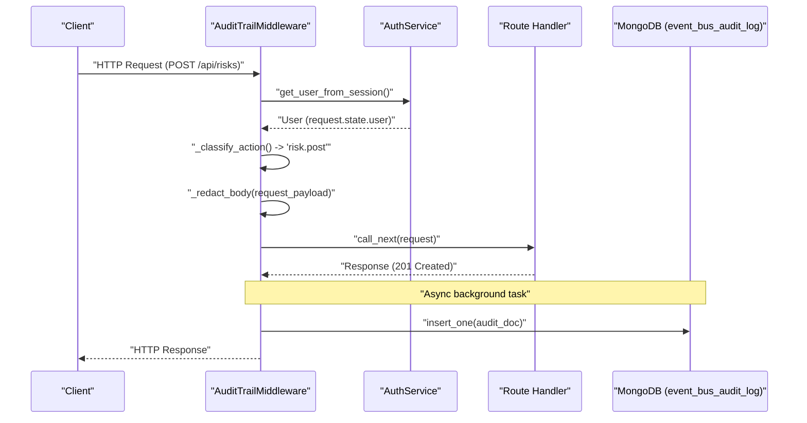
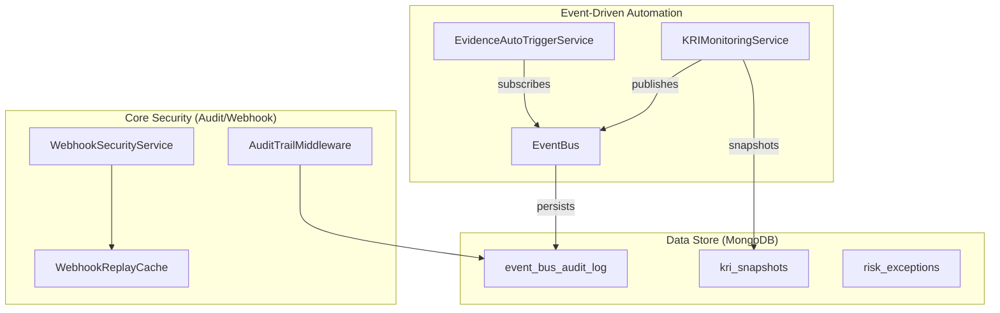

This section documents the platform's observability and event-driven architecture. It covers the immutable audit trail for user actions, the platform event bus for internal reactivity, the webhook subsystem for external integrations, and the automation of evidence collection and risk management.

## Platform Audit Trail

The platform implements a unified audit trail via the `AuditTrailMiddleware`. This middleware captures every authenticated API request and persists it to an immutable MongoDB collection named `event_bus_audit_log`. This system provides compliance-ready logs that answer who did what, when, and with what outcome.

### AuditTrailMiddleware Implementation
The middleware operates as a `BaseHTTPMiddleware` within the FastAPI pipeline. It classifies actions, redacts sensitive data, and performs asynchronous background writes to minimize latency.

*   **Action Classification**: Uses the `_classify_action` function to map HTTP methods and path patterns to human-readable strings (e.g., `POST /api/auth/login` becomes `user.login`).
*   **Recursive Body Redaction**: The `_redact_body` function recursively traverses request bodies to scrub fields like `password`, `secret`, `token`, `api_key`, and `mfa_token`. This prevents sensitive credentials buried in nested objects (e.g., within configuration payloads) from leaking into the audit store.
*   **Performance**: To prevent blocking the response, the database write is scheduled as an `asyncio.create_task` after the response has been generated.
*   **Exclusion Rules**: Noisy paths (e.g., `/api/health`, `/api/sse/`) and standard `GET` requests (except for reports/exports) are excluded to reduce log volume.

**Audit Logging Data Flow**

## Platform Event Bus (Internal)

The `EventBus` is the central nervous system for cross-module reactivity, utilizing Redis Pub/Sub for real-time delivery and MongoDB for persistence.

### Event Architecture
*   **Event Types**: Canonical constants are defined in `EventTypes`, covering `SCAN_COMPLETED`, `FINDING_CREATED`, `SLA_BREACHED`, and `COMPLIANCE_DRIFT_DETECTED`.
*   **Subscribers**: The event subscribers module registers handlers that route events to notifications (Email/Slack/Teams), integration tickets (Jira), and real-time SSE streams.
*   **SSE Real-time Stream**: The `stream_platform_events` route allows frontend clients to subscribe to specific channels (e.g., `?channels=scan,finding`) for live updates.

## Webhook Security & Inbound Ingestion

The platform accepts scan results from external tools via secure webhook endpoints.

### Webhook Security Schemes
The `WebhookSecurityService` supports two versions of HMAC authentication to ensure integrity and prevent replay attacks:

| Feature | v1 (Legacy) | v2 (Current) |
| :--- | :--- | :--- |
| **Location** | Query Parameters (`sig`, `ts`) | Headers (`X-Webhook-Signature`, `X-Webhook-Timestamp`) |
| **Body Binding** | No (Vulnerable to substitution) | Yes (HMAC includes SHA256 of body) |
| **Replay Protection** | `WebhookReplayCache` (5 min TTL) | `WebhookReplayCache` (5 min TTL) |

*   **v2 Signature Logic**: The signature is computed as `HMAC(secret, "v1:timestamp:scan_id:tool_name:body_hash")` where the body hash is a SHA256 hexdigest of the raw bytes.
*   **Replay Protection**: The `WebhookReplayCache` stores `(timestamp, signature)` pairs to prevent the same signature from being used twice within the TTL window.
*   **Ingestion**: Validated payloads are passed to the `external_scanner.receive_scan_result` for processing.

## Evidence Automation & Risk Exceptions

The platform automates the GRC lifecycle by wiring evidence collection to platform events and providing formal risk exception workflows.

### Evidence Auto-Trigger Service
The `EvidenceAutoTriggerService` eliminates manual evidence collection by reacting to `EventTypes`.
*   **Scan Completion**: Triggers `on_scan_completed`, which delegates to specific collectors (CSPM, K8s, Container, etc.) based on the `scan_type`.
*   **Freshness Monitoring**: A weekly Celery task `check_evidence_freshness` uses `_is_evidence_fresh` to identify expiring evidence and alert users.

### Risk Exception & KRI Monitoring
*   **Risk Exceptions**: The `RiskExceptionService` manages the lifecycle of suppressed findings, including creation, admin approval, and expiration tracking.
*   **KRI Monitoring**: The `KRIMonitoringService` evaluates Key Risk Indicators (e.g., `critical_vuln_count`, `sla_breach_rate`) against thresholds and emits `RISK_THRESHOLD_BREACHED` events when limits are crossed.

**Entity Space Mapping**

---