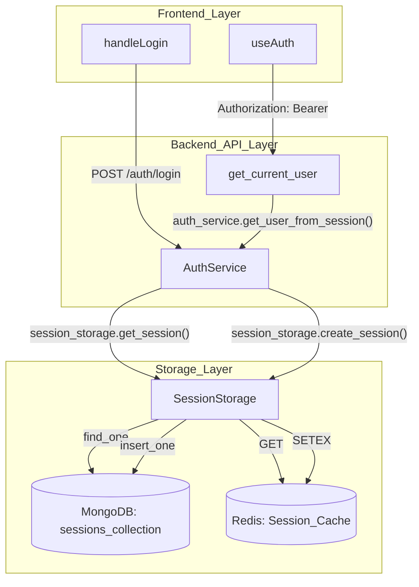
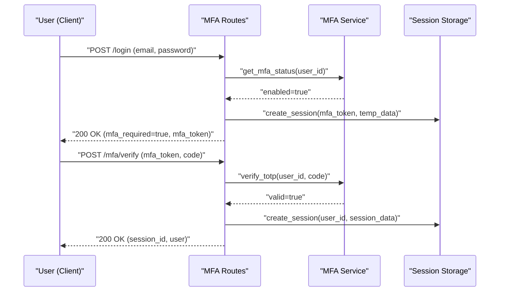

The OffloadSecurity CSPM platform implements an enterprise-grade authentication and session management system designed for high security and resilience. It features PBKDF2-based password hashing, multi-tier session persistence, and a challenge-response MFA flow.

## 1. Authentication Flow & Security

The `AuthService` manages the core identity lifecycle. It utilizes secure hashing and timing-safe practices to protect against common authentication attacks.

### 1.1. Password Hashing (PBKDF2)
Passwords are never stored in plaintext. The system uses **PBKDF2-SHA256** for hashing.
- **Iteration Count**: Modern hashes use 600,000 iterations to meet OWASP recommendations.
- **Backward Compatibility**: The system supports legacy 100,000 iteration hashes by encoding the iteration count within the salt string (format: `{iterations}${hex_salt}`).
- **Salt Generation**: A unique 16-byte hex salt is generated for every user using `secrets.token_hex(16)`.

### 1.2. Login Protection Mechanisms
- **Brute-Force Lockout**: Accounts are locked after 5 failed attempts. The lockout duration is 15 minutes (900 seconds).
- **Email Enumeration Protection**: To prevent timing attacks that reveal if an email exists, the system uses a pre-computed dummy hash (`_TIMING_PAD_HASH`). If a user is not found, the system still performs a PBKDF2 verification against this dummy hash so that response times remain consistent.

### 1.3. Identity Logic
Users are represented by the `User` class and assigned one of several roles: `ADMIN`, `SECURITY_MANAGER`, `SECURITY_ANALYST`, `COMPLIANCE_OFFICER`, `AUDITOR`, or `VIEWER`. These roles map to granular permissions calculated in `_get_permissions`.

---

## 2. Session Management & Storage

The platform employs a multi-tier `SessionStorage` architecture to ensure sessions survive server restarts and remain performant.

### 2.1. Multi-Tier Storage Strategy
The `SessionStorage` class attempts to initialize backends in the following order of priority:
1.  **Redis**: Primary high-performance store with native TTL support.
2.  **MongoDB**: Persistent fallback. Sessions are stored in the `sessions` collection with a TTL index on `expires_at`.
3.  **In-Memory**: Last resort fallback if both Redis and MongoDB are unreachable.

### 2.2. Session Security & Hashing
To prevent session hijacking via database or memory dumps, session IDs (generated as `secrets.token_urlsafe(32)`) are hashed using **SHA-256** before storage. The `create_session` method automatically hashes the raw ID before persistence.

### 2.3. Session Validation & Retrieval
The `get_current_user` dependency validates credentials in order:
1.  `Authorization: Bearer {token}` header.
2.  `X-Session-ID` header for frontend compatibility.
3.  `?token=` query parameter, accepted **only** on SSE endpoints to prevent leakage in access logs.

### Code Entity Mapping: Authentication & Session Data Flow

Title: "Auth & Session Data Flow"

---

## 3. MFA TOTP Challenge-Token Flow

The Multi-Factor Authentication (MFA) system uses a challenge-token flow to decouple the initial password check from the second-factor verification.

### 3.1. The MFA Challenge
When a user with MFA enabled logs in, the `AuthService` does not return a full session immediately. Instead, it returns an `mfa_required: true` flag and a temporary `mfa_token` challenge string.

### 3.2. Verification Flow
1.  **Setup**: User calls `/api/auth/mfa/setup` to receive a TOTP secret and QR code.
2.  **Enable**: User provides a 6-digit code to `/api/auth/mfa/enable`. Success triggers the generation of backup codes.
3.  **Verify**: During login, the user submits the `mfa_token` and the TOTP `code` to `/api/auth/mfa/verify`.

### Code Entity Mapping: MFA Verification Flow

Title: "MFA Challenge-Response Sequence"

---

## 4. Registration & Invitation System

OffloadSecurity is designed as an **invite-only** platform. Registration is managed through an invitation-based flow to ensure auditable access control.

### 4.1. Invitation Lifecycle
Users can only register if they possess a valid invitation token.
- **Registration Flow**: The registration component extracts the `invitation_token` from URL parameters.
- **Validation**: Registration requires matching the email address to which the invitation was originally sent.
- **Blocked Access**: If no token is present, the frontend displays an "Invite Only" blocked message.

### 4.2. Bootstrap & Setup Mode
For fresh installations, the platform includes a `ProtectedRoute` logic that detects if the initial setup is complete.
- **Setup Redirect**: If `/api/setup/status` returns `setup_complete: false`, users are redirected to the `/setup` route to create the first admin account.

### 4.3. Audit Trail & Webhook Integration
Every authentication event is captured by the `AuditTrailMiddleware`. Actions like `user.login` and `mfa.enable` are classified and stored in an immutable log. Furthermore, the `WebhookEventBus` can push these events (e.g., `user.login`) to external SIEM/SOAR systems.

---