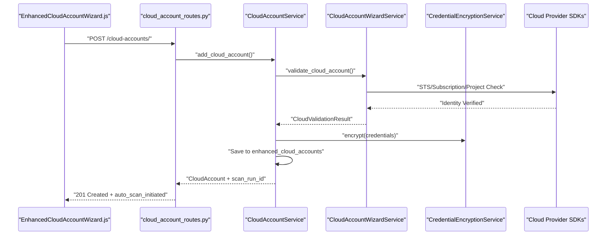
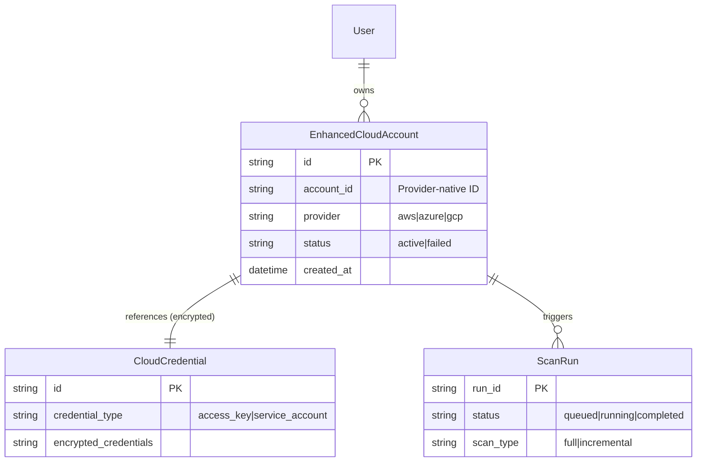

The Cloud Account Management subsystem provides enterprise-grade onboarding and lifecycle management for AWS, Azure, and GCP environments. It centralizes credential handling with high-security encryption, performs real-time connection validation using provider SDKs, and automates initial security posture discovery.

## CloudAccountService Lifecycle

The `CloudAccountService` is the primary orchestrator for managing cloud identities and their associated metadata. It manages the transition from raw credentials to an active, monitored cloud account.

### Implementation Details
*   **Duplicate Prevention**: Before adding an account, the service checks for existing provider/account ID pairs for the current user via `check_account_exists` `backend/services/cloud_account_service.py:93-129` to prevent redundant scanning and data fragmentation.
*   **Credential Centralization**: Credentials are not stored directly within the cloud account record. Instead, they are offloaded to a central store using `CloudCredentialCreate` models and the `CloudCredentialService` `backend/services/cloud_account_service.py:146-161`.
*   **Fernet Encryption**: All sensitive keys (AWS Access Keys, GCP Service Account JSONs, Azure Client Secrets) are encrypted using `CredentialEncryptionService`. This service utilizes Fernet symmetric encryption, with keys initialized during the platform setup `backend/services/cloud_account_service.py:41-68`.
*   **Database Isolation**: The service uses a dedicated `cloud_security` MongoDB database, accessible via the `CSPMDatabaseManager` or a direct fallback for Celery workers `backend/services/cloud_account_service.py:70-91`.

### Connection Testing
Connection testing is performed via provider-specific SDKs to ensure the platform has the necessary permissions (typically SecurityAudit or ReadOnly Access):
*   **AWS**: Uses `boto3` and `botocore` to verify IAM credentials and account identifiers via `AWSValidationService` `backend/services/enhanced_cloud_account_wizard_service.py:68-71`.
*   **Azure**: Utilizes `SubscriptionClient` and `ResourceManagementClient` to validate Service Principal access `backend/services/enhanced_cloud_account_wizard_service.py:80-87`.
*   **GCP**: Uses `resourcemanager_v3` and `asset_v1` to verify project access and API enablement `backend/services/enhanced_cloud_account_wizard_service.py:43-50`.

**Cloud Account Registration and Validation Flow**

Title: "Cloud Account Registration and Validation Flow"

Sources: ``backend/services/cloud_account_service.py:130-161``, ``backend/routes/cloud_account_routes.py:40-76``, ``backend/services/enhanced_cloud_account_wizard_service.py:150-175``

## Enhanced Wizard Multi-Step Onboarding

The `EnhancedCloudAccountWizard` component provides a persistent, multi-step session for complex enterprise environments.

### Wizard Steps
The onboarding process is divided into logical phases to ensure data integrity:
1.  **Provider Selection**: Selection between AWS, GCP, or Azure `frontend/src/components/cloud/EnhancedCloudAccountWizard.js:6-50`.
2.  **Environment Setup**: Defining environment (Production, Staging, Dev) and primary regions `frontend/src/components/cloud/EnhancedCloudAccountWizard.js:9-49`.
3.  **Authentication Method**: Choosing between Access Keys, Cross-Account Roles, or Service Accounts `backend/services/enhanced_cloud_account_wizard_service.py:150-155`.
4.  **Validation**: Real-time verification of permissions and API discovery via `validate_cloud_account` `backend/services/enhanced_cloud_account_wizard_service.py:150-175`.

### Session Persistence
Wizard sessions are stored in the `cloud_asset_discovery` database via `wizard_db.create_wizard_session`, allowing users to resume onboarding if interrupted `backend/services/enhanced_cloud_account_wizard_service.py:107-121`.

Sources: ``frontend/src/components/cloud/EnhancedCloudAccountWizard.js:6-50``, ``backend/services/enhanced_cloud_account_wizard_service.py:94-121``

## Credential Monitoring & Rotation

The platform tracks the health and age of cloud credentials to maintain a strong security posture.

| Metric | Warning Threshold | Critical Threshold |
| :--- | :--- | :--- |
| **Credential Age** | 60 Days | 90 Days |
| **Rotation Status** | Warning at 60 days | Critical at 90 days |

*   **Rotation Tracking**: Both `CloudAccountService` and `CloudAccountWizardService` monitor the `CREDENTIAL_ROTATION_WARNING_DAYS` threshold to flag accounts requiring updates `backend/services/cloud_account_service.py:24` `backend/services/enhanced_cloud_account_wizard_service.py:19-20`.
*   **Health Monitoring**: Accounts are assigned a `CloudAccountStatus` (Active, Pending, Failed, or Suspended) based on the success of connection heartbeats `backend/models.py:29-33`.

Sources: ``backend/services/cloud_account_service.py:24``, ``backend/services/enhanced_cloud_account_wizard_service.py:18-20``

## Account Group Management

For large-scale deployments, the platform supports grouping accounts and managing organization-level connections.

*   **Cloud Console Deep Linking**: The `cspm_findings_routes.py` includes a utility `_build_console_link` that maps resource UIDs to specific cloud console URLs (e.g., mapping `arn:aws:s3` to the S3 console path), facilitating rapid remediation `backend/routes/cspm_findings_routes.py:93-138`.
*   **Account Lookup**: The frontend implements `accountLookup` maps to resolve internal provider IDs to human-readable names across findings and asset dashboards `frontend/src/components/cloud/orchestration/CSPMFindingsViewEnhanced.js:149-156`.
*   **Revalidation**: Users can manually trigger a connection check via the `handleRevalidate` function, which calls the `/revalidate` endpoint to confirm Service Principal or IAM role health `frontend/src/components/cloud/AccountManagementDashboard.js:58-75`.

**Data Model Entity Relationship**

Title: "Cloud Account Management Entity Relationships"

Sources: ``backend/models.py:74-86``, ``backend/services/cloud_account_service.py:130-161``, ``backend/routes/cloud_account_routes.py:40-70``

## Auto-Trigger Mechanism

Upon successful creation of a cloud account, the platform initiates an initial security scan to ensure the security posture is captured immediately.

1.  **Task Initiation**: The `add_cloud_account` route returns a `scan_run_id` indicating that a scan has been successfully queued `backend/routes/cloud_account_routes.py:49-70`.
2.  **Scan Initiation UI**: The `ScanInitiationForm` allows manual triggers and selection of specific regions for AWS, GCP, or Azure `frontend/src/components/cloud/orchestration/ScanInitiationForm.js:36-48`.
3.  **Frontend Feedback**: The `add_cloud_account` response includes `auto_scan_initiated` to inform the user that discovery has started `backend/routes/cloud_account_routes.py:53-70`.

Sources: ``backend/routes/cloud_account_routes.py:40-70``, ``frontend/src/components/cloud/orchestration/ScanInitiationForm.js:36-48``

---