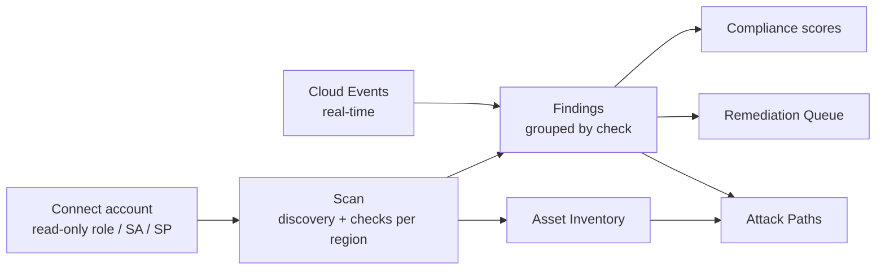

# Cloud Security (CSPM)

Cloud Security is where you connect your AWS accounts, GCP projects and Azure subscriptions, scan them for misconfigurations, and work the results down to zero. Every connection is **read-only**, every scan runs in the background, and every finding arrives with a severity, the affected resource, the compliance controls it maps to, and a fix.

## What you get

| Capability | What it does for you |
| --- | --- |
| **Posture scanning** | Runs hundreds of CIS Benchmark and best-practice checks against each connected account — per region on AWS, per project/subscription on GCP and Azure. |
| **Grouped findings** | Identical failures across resources collapse into one actionable check (the dashboard reports the noise reduction), so 100 findings read as 35 decisions. |
| **Compliance mapping** | Each check carries its framework controls — CIS, PCI DSS 4.0, SOC 2, ISO 27001, NIST 800-53 / CSF 2.0, HIPAA, GDPR, RBI, NIS2 — and rolls up into per-framework scores. |
| **Remediation workflow** | Resolve, suppress with an expiry, or create a tracked remediation task with an owner and due date. |
| **Identity & network posture** | On-demand IAM privilege analysis and network exposure views built from the same scans. |
| **Continuous monitoring** | Daily incremental and weekly full scans are scheduled the moment an account connects; real-time cloud events, SSL certificate expiry and coverage decay are tracked alongside. |
| **Asset Inventory & Attack Paths** | Every discovered resource lands in a normalized inventory that feeds attack-path analysis. |

## The Cloud Security workspace

Open **Cloud Security** in the left navigation (under *Cloud & Infrastructure*). The page is organised into tabs — each one is documented on its own page:

| Tab | Use it to | Read more |
| --- | --- | --- |
| **Coverage** | See which accounts are scanned, scheduled or uncovered, and where findings concentrate. | *This page, below* |
| **Accounts** | View connected accounts and launch a quick or full scan. | [Managing Connected Accounts](./account-management.md) |
| **Scanning** | Triage findings grouped by check, filter by account/cloud/severity/framework, resolve or suppress. | [Reviewing & Triaging Findings](./findings.md) |
| **Remediation Queue** | Track the fixes you have handed to owners. | [Remediation Queue](./remediation-queue.md) |
| **IAM Analysis** / **Network Posture** | Investigate identity risk and internet exposure. | [Identity & Network Posture](./identity-and-network.md) |
| **SSL Certificates** | Watch certificate expiry for your public domains. | [SSL Certificate Monitoring](./ssl-certificates.md) |
| **Compliance** | Read per-framework scores per account. | [Compliance & Benchmark Checks](./prowler-integration.md) |
| **Cloud Events** | Follow real-time CloudTrail / Audit Log / Activity Log events. | [Real-Time Cloud Events](./cloud-events.md) |
| **Cloud Scans** | Browse scan history and open a run's summary. | [Running Cloud Scans](./scan-orchestration.md) |

Two related pages live as their own navigation entries: **[Asset Inventory](./asset-inventory.md)** and **[Attack Path Analysis](./attack-paths.md)**. Accounts are added under **Account Setup** (see [Connecting Cloud Accounts](./connecting-accounts.md)).

## How the pieces fit

1. **Connect** an account with a read-only role, service account or service principal. The platform validates access before saving, then triggers a first scan and registers a daily incremental + weekly full schedule.
2. **Scan.** Discovery inventories resources; compliance checks evaluate configuration. Results stream in per job, so you can start triaging before the run finishes.
3. **Triage.** Work the grouped findings: open the affected resources, jump to the cloud console, resolve, suppress with an expiry, or create a task.
4. **Prove it.** Compliance scores, coverage, and reports draw from the same findings — nothing is re-entered by hand.

## Reading the Coverage tab

The Coverage tab is the landing view and the quickest health check for your cloud estate.

| Tile | Meaning |
| --- | --- |
| **Total accounts** | Accounts connected in your current team. |
| **Scanned** | Accounts with at least one finished scan (completed or partial). |
| **Scheduled** | Accounts with an active recurring scan in the Unified Scheduler. |
| **Not covered** | Connected but never scanned and not scheduled — start here. |
| **Total findings** | Open failing findings across scanned accounts. |

Below the tiles you get **Findings by Severity**, **Accounts Coverage**, **Top Accounts by Severity** (which account carries the most critical/high findings) and **Coverage Decay** — accounts whose last scan is older than 30 days, so a once-green account cannot silently go stale.

:::tip[Team scope]
Everything in Cloud Security is scoped to your **active team**. If the workspace looks empty, check the team switcher in the account menu (top-right) before assuming nothing is connected.
:::

## Prerequisites

- A role in the platform with **Manage Cloud Accounts** (to connect) and **Run Scans** / **View Scans** permissions — see [RBAC & Team Management](../authentication/rbac-team-management.md).
- Read-only access provisioned in your cloud — the exact roles are listed in [Required Permissions](./permissions.md) with copy-paste Terraform, CloudFormation and CLI.

## Next steps

- New here? Follow [Connecting Cloud Accounts](./connecting-accounts.md), then [Running Cloud Scans](./scan-orchestration.md).
- Already scanning? Go straight to [Reviewing & Triaging Findings](./findings.md).
- Automating? See the [Cloud Security API](./api.md).
- Something off? [Troubleshooting & FAQ](./troubleshooting.md).
