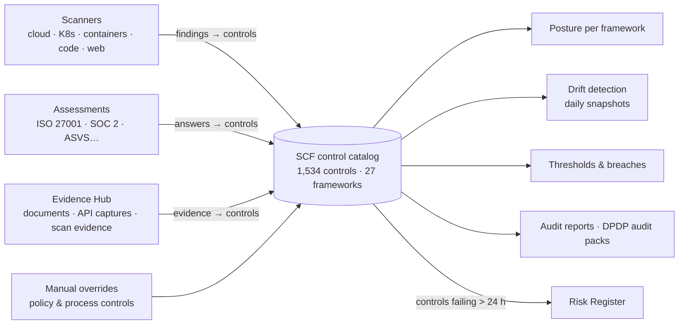

# Compliance & GRC

Compliance in Offload Security is not a spreadsheet you fill in before an audit. Every scanner in the platform, every assessment answer and every uploaded document lands on one control catalog — the **Secure Controls Framework (SCF)** — and each control is mapped to the requirements of **27 frameworks**. Implement a control once and every framework that references it moves; let a control slip and you see the regression the same day.

**Where:** left navigation → **Compliance Posture**, **Assessments**, **Audit Reports** and **DPDP Compliance** (all under *Compliance & Risk*).

## The four workspaces

| Workspace | What it is for | Pages |
| --- | --- | --- |
| **Compliance Posture** | The live picture: score per framework, every control's status, gap analysis, manual overrides, control test cadence. Four tabs: *Compliance Posture*, *Compliance Engine*, *Drift Detection*, *Evidence Hub*. | [Compliance Posture](./compliance-dashboard.md) · [Compliance Engine](./autonomous-compliance.md) · [Drift Detection](./drift-detection.md) · [Evidence Hub](./evidence-hub.md) |
| **Assessments** | Guided questionnaires for ISO 27001, SOC 2, OWASP ASVS 5.0, NIST CSF 2.0, SSDF, SAMM and more; answers feed control status. | [Assessments](./interactive-assessments.md) |
| **Audit Reports** | Audit-ready CSV packs — controls, findings, drift, remediation, scores — generated on demand and kept as history. | [Audit Reports](./audit-reports.md) |
| **DPDP Compliance** | India's Digital Personal Data Protection Act 2023 + Rules 2025 and CERT-In directions: readiness, DPIA, SDF classification, vendor due diligence, breach clocks, audit packs. | [DPDP Act (India)](./dpdp-privacy.md) |

## How it fits together

- **Scans and assessments write control status.** The compliance engine re-syncs findings into controls **every 4 hours** (and on demand), checks thresholds and runs drift detection in the same pass; a completed assessment maps its answers immediately.
- **Every control carries a status and evidence.** Status is `implemented`, `partial`, `not_implemented`, `not_assessed` or `not_applicable`; evidence is deduplicated so one artifact counts everywhere it applies.
- **Humans stay in control.** A **manual override** pins a status with a justification and is never overwritten by automation; an **exception** records why a control cannot be met, with compensating controls and an expiry.

## How a framework score is calculated

Each control in scope for a framework contributes to that framework's percentage:

| Control state | Counts as |
| --- | --- |
| **Implemented** | 1.0 |
| **Partial** | 0.5 |
| **Not implemented** or **not assessed**, but with linked evidence | 0.25 |
| **Not implemented** / **not assessed**, no evidence | 0 |
| **Not applicable** | Removed from the denominator |

The denominator is every in-scope control — *not assessed* controls do count against you, which is why a fresh installation reads low and climbs as scans, assessments and overrides land. A framework with no assessed controls at all is shown as *Not Assessed* rather than 0%.

## Start here

1. **Pick your frameworks.** Compliance Posture → **Frameworks** tile → activate the ones you report against (10 are active by default). Scores, evidence counts and thresholds are scoped to active frameworks.
2. **Let scans do the first pass.** Cloud, Kubernetes and container scans already map to controls; **Sync** on the Compliance Engine tab runs the correlation now instead of waiting for the 4-hour cycle.
3. **Run one assessment end-to-end.** ISO 27001 or SOC 2 from the Assessments hub — the answers land on SCF controls the moment you complete it. See [Assessments](./interactive-assessments.md).
4. **Override what automation cannot see.** Policies, committees, training — set them from the gap analysis with a justification. See [Compliance Posture](./compliance-dashboard.md#manual-overrides).
5. **Set thresholds and watch drift.** A threshold per framework (default 70%) turns slippage into a breach; the daily snapshot turns a downgraded control into a regression you can act on. See [Compliance Engine](./autonomous-compliance.md) and [Drift Detection](./drift-detection.md).
6. **Generate the audit pack.** [Audit Reports](./audit-reports.md) for the frameworks; the [DPDP module](./dpdp-privacy.md#audit--export) for the tamper-evident DPDP pack.

## Prerequisites

- **View Assessments** to read compliance data; **Manage Assessments** to sync, run assessments and submit exceptions; **admin** role (or an admin-scoped API key) to set manual overrides; platform administrators activate frameworks and import the SCF catalog.
- At least one connected scanner ([Cloud Security](../cloud-security/index.md), [App & Infrastructure Scanning](../security-scanning/index.md)) — not required, but it is what makes the posture move on its own.

## Related

- [Supported Frameworks](./supported-frameworks.md) — the 27-framework catalog and how SCF mappings work.
- [Risk Management](../vulnerability-risk/risk-management/index.md) — a control that stays *not implemented* or *partial* for more than 24 hours is minted as a system risk (hourly sweep, one risk per control).
- [Reports & AI](../reports-and-ai/index.md) — executive and scheduled reporting.
