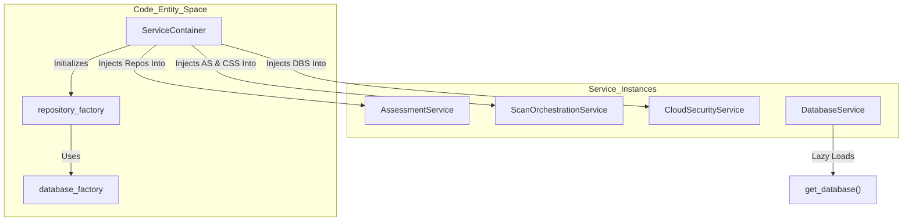
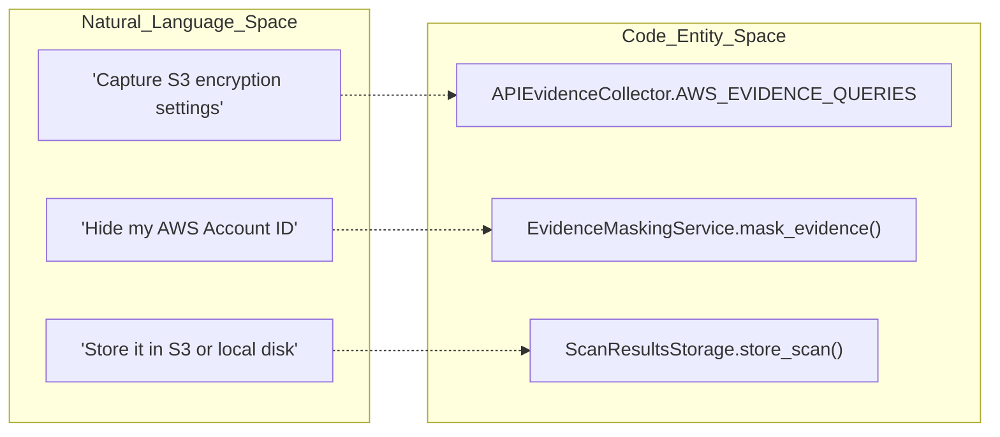

This page documents the foundational architectural patterns and shared utility services that power the OffloadSecurity CSPM platform. The system utilizes a centralized dependency injection container, a robust repository pattern for data access, optimized MongoDB aggregation pipelines, and a multi-database management strategy.

## Dependency Injection & Service Management

The platform uses a centralized `ServiceContainer` to manage the lifecycle of business logic services and data repositories. This ensures that dependencies are injected consistently across the application.

### Service Initialization Flow
The `ServiceContainer` initializes in two phases:
1.  **Repository Initialization**: Uses the `repository_factory` to create typed repositories for core entities including Assessments, Scans, Users, Teams, Risks, and Cloud Security. It includes a fallback mechanism to manual initialization using the base `db` object if the factory fails.
2.  **Service Initialization**: Constructs high-level business services (e.g., `WebSecurityService`, `ContainerSecurityService`, `CloudSecurityService`, `AIComplianceService`), injecting the core `DatabaseService` and relevant repositories.

### Service Registration System
The `ServiceContainer` acts as a registry, providing a `get_service` method to retrieve initialized instances by name. This pattern allows complex services like `ScanOrchestrationService` to depend on multiple other services (Web, Container, Cloud, and Assessment services) while maintaining a clean construction logic.

**Entity Relationship: DI and Service Graph**

---

## Data Access & Repository Pattern

The platform abstracts database interactions through a `DatabaseService` and specialized repositories to ensure data integrity and consistent query patterns.

### Database Service Operations
The `DatabaseService` provides a high-level API for MongoDB operations with built-in verification and timestamping:
*   **Document Creation**: The `create_document` method generates UUIDs, adds `created_at`/`updated_at` timestamps, and performs an immediate post-insert verification check to ensure the document was successfully persisted.
*   **Query Helpers**: Specialized methods exist for finding documents by `user_id` or `team_id`, facilitating multi-tenant data isolation.
*   **Update Logic**: The `update_document` method supports both plain field updates and MongoDB operators (like `$set` or `$push`), automatically handling the `updated_at` timestamp.

### Centralized Route Registration
To prevent server startup crashes due to individual module failures, the platform uses a centralized `register_all_routes` function. Each router import is wrapped in a try/except block, logging a warning rather than crashing if a specific module is broken. This handles everything from core auth to specialized compliance and AI routes.

---

## Storage & Evidence Patterns

The platform implements a multi-tier storage strategy for scan results and compliance evidence, prioritizing cloud providers with local fallbacks.

### Object Storage Service
The `ObjectStorageService` provides a unified interface for S3, GCS, Azure, and local filesystem backends.
*   **Connectivity Probes**: The platform includes a `test_storage_connectivity` probe that validates credentials and write permissions before configuration is saved to `.env`.
*   **Cloud-Primary Logic**: The `ScanResultsStorage` service attempts to write to cloud providers first. If the write fails, it falls back to local disk to prevent data loss.

### Evidence Masking & Collection
Before cloud API responses are stored as compliance evidence, they must pass through the `EvidenceMaskingService`.
*   **Redaction Rules**: It uses regex patterns to mask AWS Account IDs (last 4 digits only), Access Keys, Emails, and JWT/Bearer tokens.
*   **API Collection**: The `APIEvidenceCollector` maps real cloud API calls (e.g., `get_bucket_encryption`) to SCF controls like `DSP-03`.

**Natural Language to Code Entity Space: Evidence Pipeline**

---

## Caching & Performance

### Redis Cache Service
The `CacheService` provides a primary Redis interface with an in-memory fallback for environments where Redis is unavailable.
*   **Decorators**: Developers can use `@cache_result` or `@cache_user_result` to automatically cache function outputs with specific TTLs.
*   **Key Generation**: Keys are generated consistently based on function arguments and hashed if they exceed 200 characters.

### Platform Setup Wizard
The `PlatformSetupService` manages the first-time configuration of the platform.
*   **Secret Generation**: It auto-generates Fernet keys for cloud credentials and hex secrets for JWT signing using `secrets` and `cryptography` libraries.
*   **Validation**: It validates MongoDB and Redis connectivity before marking setup as complete.
*   **Locking**: Once setup is complete, mutation endpoints are locked via environment variables and database flags.