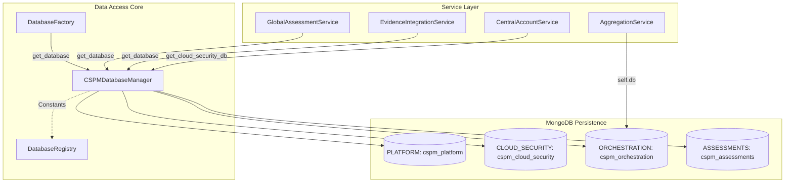
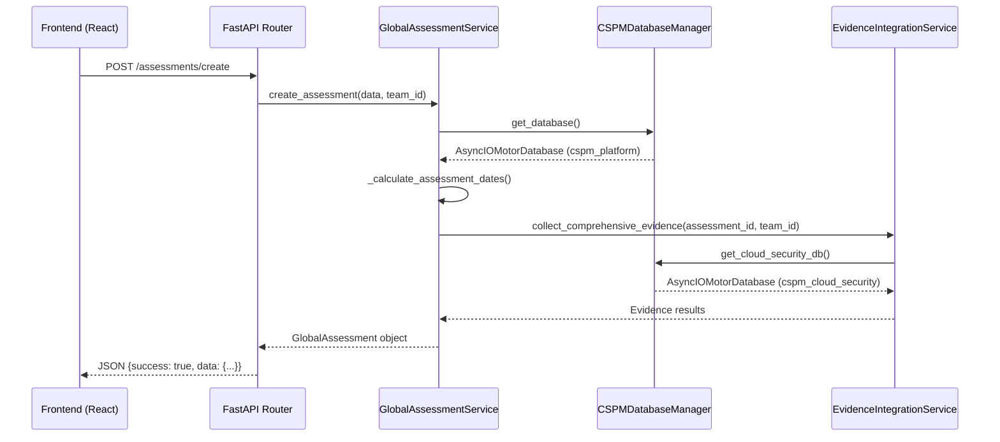

The Data Layer and Core Services form the backbone of the OffloadSecurity CSPM platform. This layer is responsible for multi-database management, persistent storage of scan results, and providing shared infrastructure services—including dependency injection, standardized response handling, and the repository pattern—that are used across all security modules.

## Database Architecture

The platform utilizes a **multi-database MongoDB architecture** to ensure data isolation, scalability, and modularity. Instead of a single monolithic database, the system partitions data into 14+ distinct databases based on functional domains (e.g., `cspm_cloud_security`, `cspm_risk_management`, `cspm_assessments`).

The `CSPMDatabaseManager` class serves as the central orchestrator. It utilizes a singleton client factory via `get_async_client` to manage connections using the `motor` async driver. For standardizing these names, the `DatabaseRegistry` acts as the single source of truth for database constants and purpose mapping.

### Database Distribution
| Database Alias | Registry Constant | Purpose |
|:---|:---|:---|
| `core` | `PLATFORM` | Platform settings, users, sessions, and audit logs. |
| `cloud_security` | `CLOUD_SECURITY` | Cloud accounts (consolidated), Prowler findings, and scores. |
| `native_scans` | `SECURITY_SCANS` | Persistent storage for Nuclei, SSL, and Header scans. |
| `orchestration` | `ORCHESTRATION` | Scan runs, jobs, and sub-job lifecycle state. |
| `vulnerabilities` | `VULNERABILITIES` | Vulnerability occurrences (UVM), catalog, and SLA policies. |
| `ai_governance` | `AI_GOVERNANCE` | AI models, risk assessments, and EU AI Act compliance data. |

For details on collection schemas, cross-module references, and index management, see **Database Architecture**.

## Core Service Infrastructure

Shared services provide standardized functionality to API routes and background workers, ensuring that operations like dependency injection and reporting are performed consistently.

### Dependency Injection & Service Container
The platform uses a `ServiceContainer` to manage the lifecycle of services and repositories. It initializes repositories using a `RepositoryFactory` and then injects these into business logic services. This pattern is extended to specialized services like the `CentralAccountService` which acts as the single source of truth for cloud account management.

### Standardized API Responses
The `ResponseService` provides a unified way to return `success_response` or `error_response`. This is heavily utilized across the platform's modular routers to ensure consistent JSON structures for the frontend.

### Cross-Module Data Access & Aggregation
While data is isolated into multiple databases, the platform supports cross-module logic through services like `AggregationService`. This service uses MongoDB `$facet` and `$lookup` pipelines to reduce database round trips by 40-60%. For example, `get_dashboard_summary` replaces up to 10 separate queries with a single aggregation.

Specialized integration services like `AssessmentIntegrationService` and `EvidenceIntegrationService` bridge different modules by collecting data from multiple databases to satisfy compliance and risk assessment requirements.

For details on the repository pattern, caching with Redis, and credential encryption, see **Core Service Patterns & Utilities**.

## System Integration Diagram

This diagram illustrates how the `DatabaseFactory` and `CSPMDatabaseManager` bridge the logical security modules to specific code entities and storage.

## Request & Data Flow

The following diagram traces a request through the backend core services to the multi-database storage, specifically showing how dependencies are resolved for the Global Assessment module.

## Data Integrity & Architecture Contracts

The platform enforces strict architectural contracts to ensure stability and deployment consistency:
*   **Collection Consolidation**: The platform enforces a contract where no production code may query the legacy `cloud_accounts` collection; all cloud account data must reside in `enhanced_cloud_accounts`.
*   **Database Single Source of Truth**: All database names and purpose mappings must be derived from `DatabaseRegistry` to avoid connection proliferation.
*   **Cross-DB Aggregation Restrictions**: The `AggregationService` is prohibited from using `$lookup` for cross-database joins (e.g., joining orchestration and cloud security data in a single pipeline), as MongoDB `$lookup` is single-DB only. Metadata resolution for such cases must be performed via explicit cross-DB queries.
*   **Migration Idempotency**: Maintenance scripts must be idempotent, checking fields like `embedding_model_used` before performing expensive operations.

---