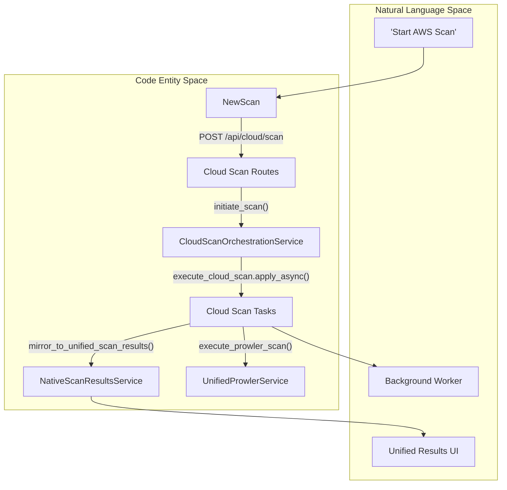
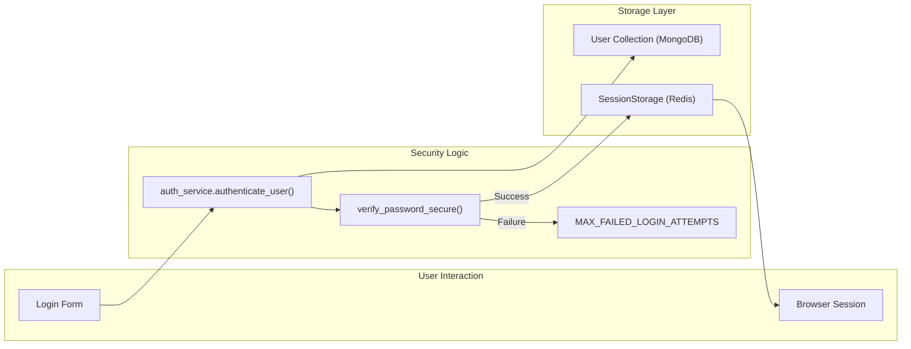

This page provides technical definitions for the domain-specific terms, architectural patterns, and acronyms used throughout the OffloadSecurity CSPM codebase.

## Core Architectural Concepts

### CSPM (Cloud Security Posture Management)
The primary domain of the application, focusing on the automated identification and remediation of risks across cloud infrastructures (AWS, GCP, Azure).
*   **Implementation**: Managed via the `CloudSecurityManagement` component and the `CloudScanOrchestrationService`.

### ScanRun & SubJob
The hierarchical model used to track cloud security scans. A `ScanRun` represents a high-level request (e.g., "Scan AWS Account X"), while `SubJobs` are granular tasks dispatched to Celery workers for specific regions or tools (Prowler, Steampipe).
*   **Implementation**: Defined in the `ScanRun` and `SubJob` models. Orchestrated by `execute_cloud_scan`.

### Unified Scan Results Store
A canonical MongoDB collection (`scan_results`) within the `native_scans` database that aggregates status and summary data from all scan types (Web, Network, Cloud, Container). This allows the frontend to display a single "Scan History" view.
*   **Implementation**: Managed by `mirror_to_unified_scan_results` and the `NativeScanResults` component.

### OCSF (Open Cybersecurity Framework)
The standardized JSON format used for normalizing findings from disparate security tools. Prowler findings are parsed and mapped to OCSF-compatible structures before ingestion.
*   **Implementation**: Handled in the `UnifiedProwlerService` parsing layer.

### BIA (Business Impact Analysis)
A process to determine the criticality of business activities and resource requirements. The system uses specific lifecycle and analytics management.
*   **Implementation**: Managed via the `BusinessImpactAnalysis` component and the BIA lifecycle routes.

---

## Identity & Access Control

### RBAC (Role-Based Access Control)
The authorization model defining what actions a user can perform based on their assigned `UserRole`.
*   **Roles**: `ADMIN`, `SECURITY_MANAGER`, `SECURITY_ANALYST`, `COMPLIANCE_OFFICER`, `AUDITOR`, `VIEWER`.
*   **Enforcement**: Handled via `_get_permissions` and the `require_permission` dependency.

### PBKDF2 Iterations
The system uses `PBKDF2-SHA256` for password hashing. It supports a legacy iteration count (100k) and a hardened production count (600k) for OWASP compliance.
*   **Implementation**: Constants defined in `PBKDF2_ITERATIONS`. Verification logic in `verify_password_secure`.

### Team Context
A multi-tenancy pattern where data is isolated by `team_id`. This ensures organizational data separation even when multiple teams share the same cloud provider credentials.
*   **Implementation**: Applied in `initiate_scan` and managed via `get_user_team_id`.

---

## Scanning & Ingestion Engines

### Unified Prowler Service
A consolidated execution engine for Prowler that manages Docker-in-Docker (DinD) execution, artifact storage in S3/MinIO, and dual ingestion into CSPM and UVM databases.
*   **Implementation**: `UnifiedProwlerService`.
*   **Execution**: Uses `PROWLER_HOST_OUTPUT_DIR` to handle volume mapping between sibling containers.

### KEV (Known Exploited Vulnerabilities)
A threat intelligence enrichment process using the CISA KEV catalog to prioritize vulnerabilities that are actively being exploited in the wild.
*   **Implementation**: `_enrich_with_kev`.

### SCF (Secure Controls Framework)
The foundational compliance registry used by the platform, containing over 1,000 controls mapped across different domains.
*   **Implementation**: Synchronized via the `import-scf` endpoint.

### Autonomous Compliance Engine
An engine that continuously monitors compliance posture by syncing scan findings to SCF controls and calculating implementation scores.
*   **Implementation**: Managed by `AutonomousComplianceEngine` and triggered via `/compliance-engine/sync`.

### Knowledge Base (RAG)
The AI-powered document Q&A system that uses Retrieval-Augmented Generation (RAG). It ingests security policies and uses embeddings for semantic search.
*   **Implementation**: Managed by `KnowledgeBaseService`.
*   **AI Integration**: Uses `LlmChat` with configurable providers like OpenAI, Anthropic, or Google.

---

## Technical Diagrams

### Scan Orchestration Data Flow
This diagram bridges high-level scan requests to the specific code entities responsible for background execution and result unification.

Title: Cloud Scan Execution Lifecycle

### Authentication and Session Flow
This diagram maps the login process to the security mechanisms implemented in the core authentication module.

Title: Secure Authentication Mapping

---

## Database Registry

The platform uses a multi-database MongoDB architecture. Each service is responsible for its own database context via the `DatabaseRegistry`.

| Database Name | Purpose | Key Service/Route |
| :--- | :--- | :--- |
| `cspm_platform` | Core users, teams, and sessions | `auth_service` |
| `orchestration` | Scan runs, sub-jobs, and regional status | `CloudScanOrchestrationService` |
| `vulnerability` | Unified vulnerability occurrences and catalog | `VulnerabilityManagementService` |
| `native_scans` | Unified tool results for the history UI | `NativeScanResultsService` |
| `knowledge_base` | Document embeddings and metadata | `KnowledgeBaseService` |