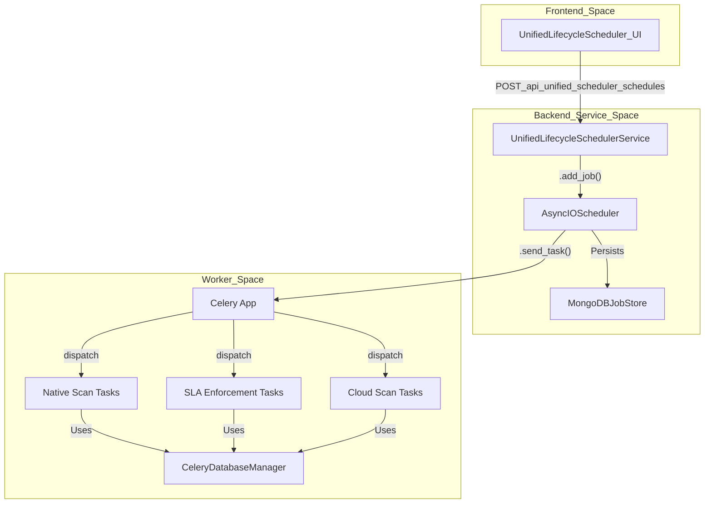
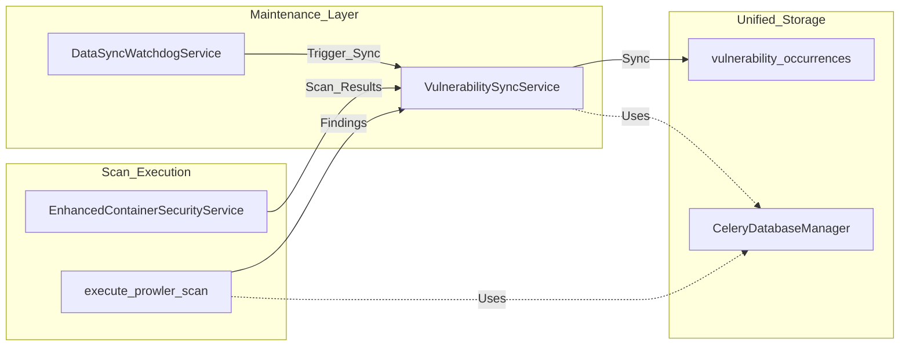

The OffloadSecurity CSPM platform utilizes a distributed task queue system based on **Celery** and **Redis**, complemented by a **Unified Lifecycle Scheduler** built on **APScheduler**. This architecture ensures that long-running security scans, compliance audits, and system maintenance tasks do not block the main application thread while providing robust persistence and retry logic.

## Celery Application Configuration

The Celery application is the primary engine for asynchronous execution. It is configured to use **Redis** as the message broker and **MongoDB** as the result backend, specifically targeting the `cspm_orchestration` database.

### Task Queues & Routing
To prevent resource contention between lightweight maintenance and heavy scanning tasks, the platform implements strict queue isolation:

| Queue | Purpose | Key Tasks |
| :--- | :--- | :--- |
| `scans` | Primary orchestration | `execute_cloud_scan`, `run_scheduled_scans` |
| `discovery` | Resource inventory | `execute_steampipe_discovery`, `execute_hybrid_asset_discovery`, `execute_kubernetes_cluster_discovery` |
| `compliance` | Posture assessment | `execute_prowler_scan`, `run_compliance_refresh`, `snapshot_all_teams` |
| `threat_feeds` | Intelligence updates | `fetch_all_enabled_feeds`, `cleanup_old_indicators` |
| `sync` | Data consistency | `sync_all_teams_vulnerabilities`, `sync_vulnerabilities_for_team` |
| `maintenance` | System hygiene | `run_retention_cycle`, `check_sla_breaches_all_teams`, `run_data_sync_watchdog` |

### Celery Database Management
A critical architectural pattern in the platform is the use of `CeleryDatabaseManager`. Standard database singletons (like `CSPMDatabaseManager`) are bound to the FastAPI main process event loop. Because Celery workers create and close a new event loop for every task, using singletons leads to `RuntimeError: Event loop is closed`.

The `CeleryDatabaseManager` creates a **fresh** `AsyncIOMotorClient` for every task, ensuring the connection is bound to the current worker loop.

---

## Unified Lifecycle Scheduler

The `UnifiedLifecycleSchedulerService` manages the temporal aspects of security entities, consolidating scans, assessments, evidence collection, and reports. It uses **APScheduler** with a `MongoDBJobStore` to ensure that schedules persist across service restarts.

### Schedule Types & Statuses
The scheduler supports four distinct triggers:
1.  **CRON**: Complex calendar-based schedules (e.g., "0 2 * * *").
2.  **INTERVAL**: Simple recurring timers (e.g., every 24 hours).
3.  **EXPIRY_BASED**: Triggers based on entity age, such as a risk assessment expiring.
4.  **ONE_TIME**: Specific future timestamps.

### Zombie Schedule Prevention & Overlap Policies
To prevent system exhaustion and "stampede" conditions where multiple instances of the same long-running scan overlap, the scheduler implements an `OverlapPolicy`:
- **SKIP**: If a previous run is still active, the new trigger is ignored.
- **QUEUE**: Queues the new run to start after the current one finishes.
- **CANCEL_PREVIOUS**: Terminates the running job and starts a fresh one.

### Implementation Diagram: Scheduler to Code Entities
This diagram illustrates how the `UnifiedLifecycleSchedulerService` interacts with the Celery task infrastructure and the database layer.

Title: "Scheduler and Task Execution Mapping"

---

## Cloud Scan Orchestration Tasks

### Execution Flow
The `execute_cloud_scan` task is the primary entry point for cloud security assessments. It manages the lifecycle of a `ScanRun`.

1.  **Initialization**: Reuses a single event loop per `ForkPoolWorker` process but creates a fresh `AsyncIOMotorClient` to avoid loop conflicts.
2.  **Status Mirroring**: Updates the unified Scan Results store via `mirror_to_unified_scan_results` so the scan appears in the "running" tab of the UI.
3.  **Sub-Job Dispatch**: Dispatches lightweight discovery jobs (Steampipe) and heavy compliance jobs (Prowler).
4.  **Batching & Staggering**: Compliance jobs are staggered using a `countdown` based on `REGION_BATCH_SIZE` to prevent API rate limiting.

### Native Security Scans
The platform executes "native" scans (Web/ZAP, Network/Nmap, SSL/testssl) through dedicated Celery tasks. These tasks use a fresh database client via `CeleryDatabaseManager` to ensure the Motor client is always bound to the correct event loop.

---

## Maintenance & Watchdog Tasks

### Data Sync Watchdog
The `DataSyncWatchdogService` periodically monitors data consistency across platform modules.
- **Stuck Scan Detection**: Identifies scans running longer than `STUCK_SCAN_HOURS` (4 hours).
- **Reconciliation**: When a mismatch is detected, it dispatches the appropriate existing sync task (e.g., `compliance_refresh`, `vulnerability_sync`).

### Vulnerability Sync
The `VulnerabilitySyncService` synchronizes findings from CSPM, Kubernetes, and Container modules into the unified Vulnerability Management system.
- **Source Aggregation**: Pulls from `cspm_findings`, `k8s_findings`, and `container_scans`.
- **Deduplication**: Uses a stable `dedup_key` to prevent duplicate occurrences during sync.

### Data Flow Diagram: Ingestion and Sync
Title: "Finding Ingestion and Sync Flow"

---