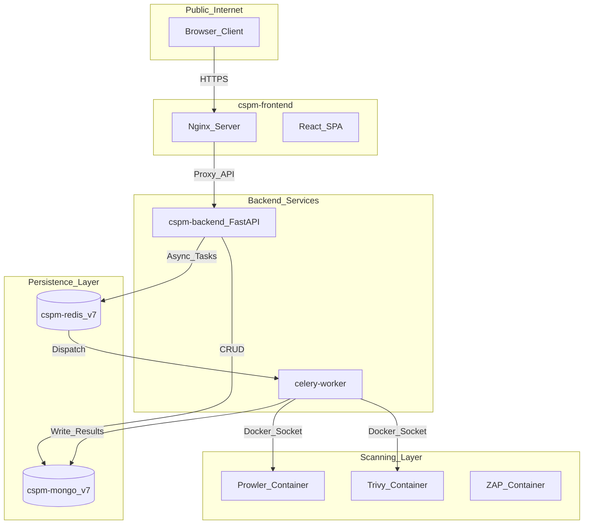
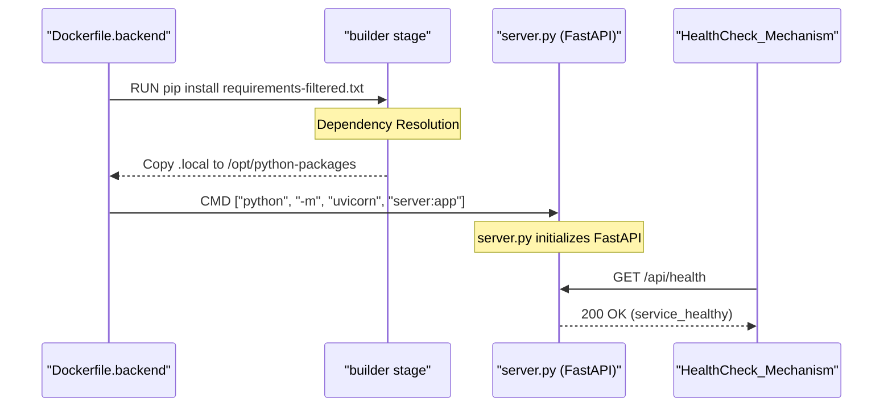
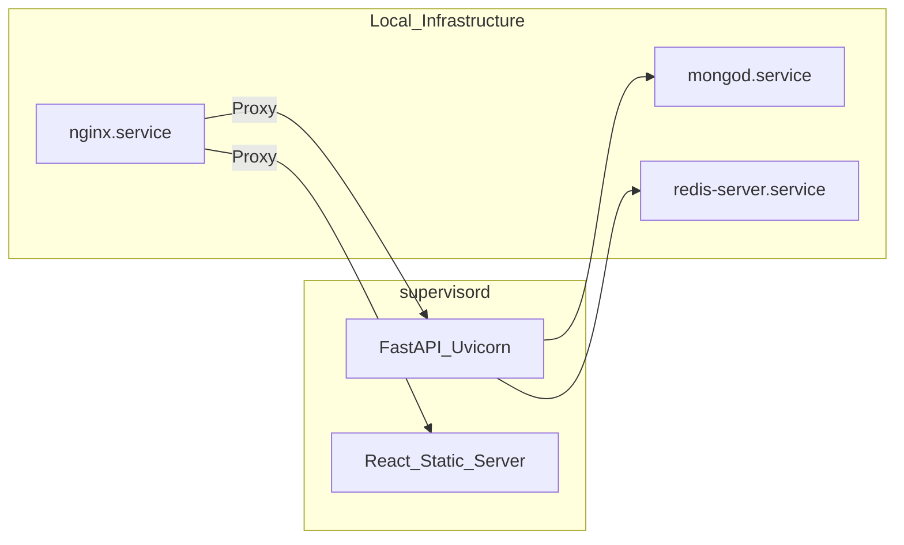

The OffloadSecurity CSPM platform utilizes a multi-service architecture designed for high availability, security, and scalability. It supports containerized deployment via **Docker Compose** for rapid orchestration and **Bare-Metal** installation for enterprise environments requiring direct control over system resources.

## Docker Compose Architecture

The platform is orchestrated using a production-hardened `docker-compose.yml` that manages the core service categories. This architecture ensures process isolation and provides a standardized environment for security scanning tools.

### Service Grid & Data Flow

The following diagram illustrates the interaction between the core services, including the Docker-in-Docker (DinD) pattern used for security scanning.

**Diagram: Containerized Service Architecture**

Sources: `docker-compose.yml:10-210`, `deployment/Dockerfile.backend:135-135`

### Docker-in-Docker (DinD) Scanning Pattern
The platform executes security tools like **Prowler**, **Trivy**, and **ZAP** as sibling containers. The `backend` and `celery-worker` containers mount the host's `/var/run/docker.sock` `docker-compose.yml:129-129` and use the `PROWLER_HOST_OUTPUT_DIR` environment variable `docker-compose.yml:120-120` to resolve absolute host paths for volume mounting findings back into the system. The `backend` container includes the Docker CLI as a static binary to facilitate these interactions `deployment/Dockerfile.backend:69-72`.

The backend image also pre-installs several scanning binaries directly for performance and to avoid root-privilege issues with the Docker socket during code scans. These include `opengrep` (SAST), `gitleaks` (secrets), `osv-scanner` (SCA), `syft` (SBOM), and `grype` (vulnerabilities) `deployment/Dockerfile.backend:87-128`.

## Environment Configuration

Configuration is managed via a central `.env` file. The `scripts/setup/docker-setup.sh` wizard automates the generation of these secrets, including Fernet keys and HMAC secrets `scripts/setup/docker-setup.sh:160-165`.

| Variable | Purpose | Code Reference |
| :--- | :--- | :--- |
| `SECRET_KEY` | JWT token signing and session encryption | `.env.example:39-39` |
| `CLOUD_ENCRYPTION_KEY` | Fernet key for encrypting Cloud Credentials in MongoDB | `.env.example:34-34` |
| `MONGO_URL` | Primary connection string for the 14+ databases | `docker-compose.yml:107-107` |
| `PROWLER_HOST_OUTPUT_DIR` | Absolute host path for sibling container volume mounts | `docker-compose.yml:120-120` |
| `WEBHOOK_SECRET` | HMAC-SHA256 secret for outbound webhook signing | `.env.example:40-40` |
| `DOCKER_GID` | Host Docker group ID to permit socket access | `docker-compose.yml:141-142` |

Sources: `.env.example:1-112`, `scripts/setup/docker-setup.sh:160-165`, `docker-compose.yml:120-142`

## Build Validation & Integrity

To prevent "broken" deployments, the platform includes a strict build validation phase and runtime monitoring.

### Build-Time Validation
The `deployment/Dockerfile.backend` uses a multi-stage build where the `builder` stage prepares dependencies `deployment/Dockerfile.backend:4-36`. A critical validation step involves verifying that all required Python packages are correctly resolved before the final image is produced. If private packages fail, the build continues, but critical public packages must succeed `deployment/Dockerfile.backend:31-36`.

### Runtime Integrity Monitoring
The system ensures that critical dependencies are healthy at runtime via health check endpoints. The backend container performs a health check against the `/api/health` route `docker-compose.yml:156-160`, while the frontend checks its own availability `docker-compose.yml:200-204`. MongoDB and Redis also have integrated health checks to ensure the `backend` and `celery-worker` only start when infrastructure is ready `docker-compose.yml:47-52`, `docker-compose.yml:85-89`.

**Diagram: Deployment Integrity Flow**

Sources: `deployment/Dockerfile.backend:31-39`, `docker-compose.yml:156-160`, `docker-compose.yml:161-165`

## Nginx & SSL Configuration

The platform uses Nginx as a reverse proxy to handle SSL termination, rate limiting, and large file uploads.

### Request Timeouts
The Nginx configuration is synchronized with the backend `TimeoutMiddleware` to handle heavy security scans.
*   **Standard Path**: 30s timeout `backend/core/middleware_setup.py:100-100`.
*   **Slow Paths**: 600s timeout for cloud validation and assessments `backend/core/middleware_setup.py:101-101`.
*   **Upload Heavy Paths**: 900s timeout for code-scan ZIPs up to 500MB `backend/core/middleware_setup.py:102-102`.
*   **Nginx Sync**: Nginx `proxy_read_timeout` and `proxy_send_timeout` are set to `900s` to match these backend requirements `deployment/nginx.conf:42-43`, `deployment/nginx-ssl.conf.template:107-109`.

### ACME Challenge & Certbot
The `certbot` container `docker-compose.yml:211-215` handles Let's Encrypt certificates. Nginx is configured to serve the `.well-known/acme-challenge/` directory to facilitate the HTTP-01 challenge `deployment/nginx-ssl.conf.template:31-33`.

### Caching Strategy
To prevent stale frontend code after redeployment, the `index.html` entry point is explicitly configured with `no-cache` headers `deployment/nginx.conf:67-84`, `deployment/nginx-ssl.conf.template:138-157`. Static assets under `/static/` use immutable long-term caching `deployment/nginx.conf:87-90`.

Sources: `deployment/nginx.conf:32-90`, `deployment/nginx-ssl.conf.template:31-162`, `backend/core/middleware_setup.py:31-137`

## Bare-Metal Deployment

For non-Docker environments, the platform provides idempotent installation scripts supporting Ubuntu 24 and Debian 12.

### Supervisor Management
The platform uses **Supervisor** for process management in bare-metal setups, enabling blue/green deployment strategies `deployment/manual-deploy-ubuntu24.sh:203-211`.
*   **Blue Instance**: Backend on port 8001, Frontend on 3000 `deployment/manual-deploy-ubuntu24.sh:40-41`.
*   **Green Instance**: Backend on port 8002, Frontend on 3001 `deployment/manual-deploy-ubuntu24.sh:40-41`.

### Idempotent Installation
The `deployment/install.sh` and `deployment/manual-deploy-ubuntu24.sh` scripts automate the installation of:
1.  **Python 3.12**: Installed via deadsnakes PPA on Ubuntu or built from source on Debian `deployment/install.sh:110-147`.
2.  **Node.js 20 & Yarn**: Configured via NodeSource and official Yarn repositories `deployment/manual-deploy-ubuntu24.sh:107-147`.
3.  **MongoDB 7.0 & Redis 7**: Configured with automatic service enablement and status verification `deployment/manual-deploy-ubuntu24.sh:152-198`.

**Diagram: Bare-Metal Process Management**

Sources: `deployment/manual-deploy-ubuntu24.sh:37-211`, `deployment/setup-nginx-single-server.sh:44-51`, `deployment/install.sh:91-180`

---