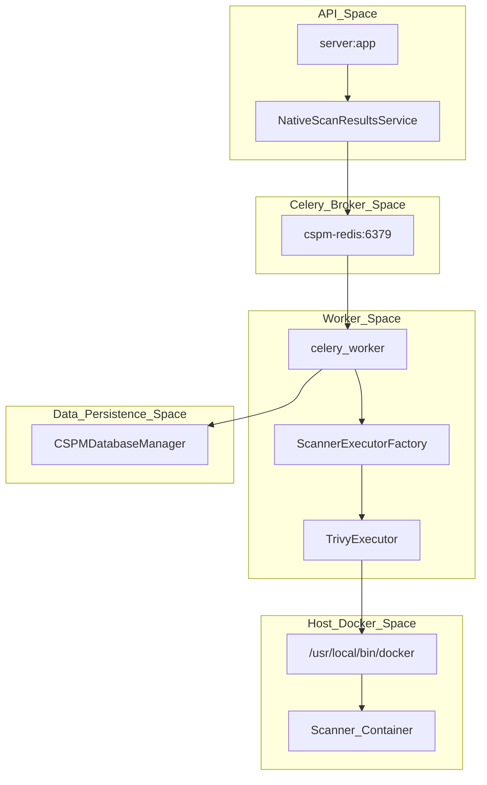
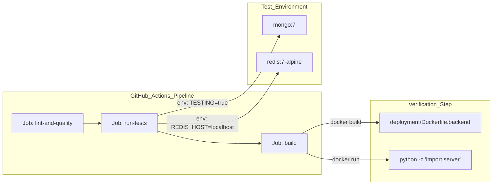

This section provides a technical overview of the OffloadSecurity CSPM platform's operational architecture, including its containerized deployment model, asynchronous task processing, monitoring infrastructure, and automated CI/CD pipelines.

## Deployment & Configuration

The platform is designed as a multi-service architecture orchestrated via **Docker Compose**. It utilizes a hardened production configuration that isolates infrastructure components (MongoDB, Redis) from the public-facing services (Backend API, React Frontend).

### Multi-Service Architecture
The standard deployment consists of several interconnected services. The backend is built using a multi-stage Dockerfile to ensure a lean runtime environment `deployment/Dockerfile.backend:4-39`.

| Service | Role | Key Technology |
| :--- | :--- | :--- |
| `cspm-mongo` | Primary data store for platform and scan data | MongoDB 7 `docker-compose.yml:15` |
| `cspm-redis` | Task broker and session cache | Redis 7-Alpine `docker-compose.yml:60` |
| `cspm-backend` | Core API and scan orchestration | FastAPI / Python 3.12 `deployment/Dockerfile.backend:39` |
| `cspm-frontend` | Security dashboard and management UI | React / Nginx `deployment/Dockerfile.frontend:26` |
| `cspm-certbot` | Automated SSL/TLS certificate management | Let's Encrypt / ACME `docker-compose.yml:206` |

### Infrastructure Setup
The backend container includes critical security tools like `nmap`, `syft`, `grype`, and `trivy` directly in the image `deployment/Dockerfile.backend:50-105`. A specialized `validate_build.py` script acts as a safety net during the build process, verifying that all route files compile and critical Python packages are importable `deployment/Dockerfile.backend:24-28`. Deployment is simplified by the `docker-setup.sh` interactive wizard which handles secret generation, environment configuration, and host-level tuning for Redis `scripts/setup/docker-setup.sh:1-20`.

For details, see **Deployment & Configuration**.

---

## Background Tasks & Scheduler

The platform offloads long-running security scans and maintenance operations to a distributed task queue powered by **Celery**. This ensures the API remains responsive while intensive operations run in the background.

### Task Orchestration Flow
Security scans follow a "Launch-and-Poll" pattern. The system utilizes a Docker-in-Docker sibling container pattern where the `cspm-backend` triggers tool execution via the host's Docker socket `docker-compose.yml:128-132`.

*Sources: `deployment/Dockerfile.backend:68-72`, `docker-compose.yml:128-137`, `backend/services/webhook_security_service.py:14-18`*

### Results Management
The system uses the `WebhookSecurityService` to generate signed callback URLs for scanners. This service ensures that results ingested via the webhook are authentic by validating HMAC-SHA256 signatures and checking for timestamp expiration `backend/tests/unit/test_webhook_security.py:32-108`.

For details, see **Background Tasks & Scheduler**.

---

## Monitoring & Observability

The platform includes a built-in monitoring stack to ensure system integrity and track scan performance. This stack is integrated into the core architecture through health endpoints and structured logging.

### Health & Integrity
The backend implements a comprehensive health check at `/api/health`, used by Docker to determine container status `docker-compose.yml:155-160`.
*   **SSL Automation:** The `nginx-entrypoint.sh` script manages the transition from HTTP to HTTPS automatically once Certbot obtains valid certificates `deployment/nginx-entrypoint.sh:26-32`.
*   **Metrics & Logs:** Every module emitter routes through a metrics singleton, rendered at `GET /metrics` for Prometheus scraping `docs/observability-runbook.md:18-22`. Structured logs are shipped to Loki via **promtail** `docs/observability-runbook.md:23-27`.
*   **Resource Limits:** Production hardening is applied via Docker Compose `ulimits` and resource constraints `docker-compose.yml:31-41, 75-79`.

For details, see **Monitoring & Observability**.

---

## Testing & CI/CD

The platform maintains high code quality through a rigorous GitHub Actions pipeline that enforces linting, security standards, and architectural contracts.

### Pipeline Structure
The platform utilizes two primary workflows: `ci.yml` for pull requests and `deploy.yml` for production releases `.github/workflows/ci.yml:1-8`, `.github/workflows/deploy.yml:1-14`.

*Sources: `.github/workflows/deploy.yml:24-218`, `.github/workflows/ci.yml:147-172`, `deployment/Dockerfile.backend:1-10`*.

### Security Testing
The test suite covers critical security components, including:
*   **Auth System:** Validates PBKDF2 hashing and first-user-is-admin logic `backend/tests/unit/test_auth.py:57-129`.
*   **Middleware:** Tests rate limiting logic for login/register endpoints and security header injection `backend/tests/unit/test_security_middleware.py:51-77`.
*   **Webhook Security:** Verifies HMAC-SHA256 signature generation and TTL-based expiration for scan callbacks `backend/tests/unit/test_webhook_security.py:32-108`.

For details, see **Testing & CI/CD**.

---

## Operational Tooling Summary

| Tool | Purpose | Code Reference |
| :--- | :--- | :--- |
| `validate_build.py` | Build-time integrity & dependency check | `deployment/Dockerfile.backend:24` |
| `docker-setup.sh` | Interactive configuration and secret generation | `scripts/setup/docker-setup.sh:197` |
| `nginx-entrypoint.sh` | Automated SSL activation & ACME challenge | `deployment/nginx-entrypoint.sh:1-56` |
| `promtail` / `Loki` | Log aggregation and shipping | `docs/observability-runbook.md:23-27` |
| `syft` / `grype` | Native SBOM and vulnerability scanning | `deployment/Dockerfile.backend:87-89` |

**Sources:**
*   Deployment Workflows: `.github/workflows/deploy.yml:1-210`, `.github/workflows/ci.yml:1-179`
*   Container Images: `deployment/Dockerfile.backend:1-135`, `deployment/Dockerfile.frontend:1-53`
*   Infrastructure Config: `docker-compose.yml:1-200`, `.env.example:1-112`
*   Security validation: `backend/tests/unit/test_auth.py:1-130`, `backend/tests/unit/test_webhook_security.py:1-170`, `backend/tests/unit/test_security_middleware.py:1-100`
*   Observability: `docs/observability-runbook.md:1-95`

---