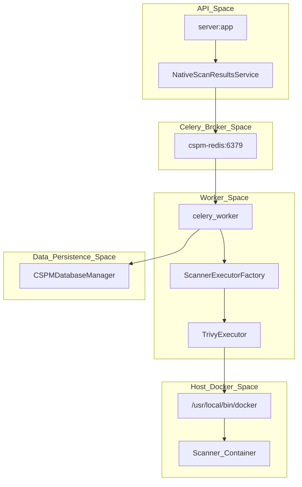
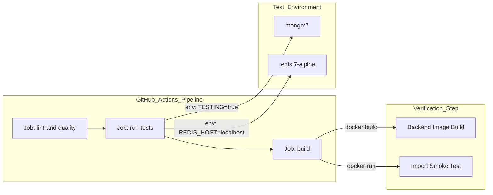

This section provides a technical overview of the OffloadSecurity CSPM platform's operational architecture, including its containerized deployment model, asynchronous task processing, monitoring infrastructure, and automated CI/CD pipelines.

## Deployment & Configuration

The platform is designed as a multi-service architecture orchestrated via **Docker Compose**. It utilizes a hardened production configuration that isolates infrastructure components (MongoDB, Redis) from the public-facing services (Backend API, React Frontend).

### Multi-Service Architecture
The standard deployment consists of several interconnected services. The backend is built as a multi-stage container image to ensure a lean runtime environment.

| Service | Role | Key Technology |
| :--- | :--- | :--- |
| `cspm-mongo` | Primary data store for platform and scan data | MongoDB 7 |
| `cspm-redis` | Task broker and session cache | Redis 7-Alpine |
| `cspm-backend` | Core API and scan orchestration | FastAPI / Python 3.12 |
| `cspm-frontend` | Security dashboard and management UI | React / Nginx |
| `cspm-certbot` | Automated SSL/TLS certificate management | Let's Encrypt / ACME |

### Infrastructure Setup
The backend container includes critical security tools like `nmap`, `syft`, `grype`, and `trivy` directly in the image. A specialized build validation script acts as a safety net during the build process, verifying that all route files compile and critical Python packages are importable. Deployment is simplified by an interactive setup wizard which handles secret generation, environment configuration, and host-level tuning for Redis.

For details, see **Deployment & Configuration**.

---

## Background Tasks & Scheduler

The platform offloads long-running security scans and maintenance operations to a distributed task queue powered by **Celery**. This ensures the API remains responsive while intensive operations run in the background.

### Task Orchestration Flow
Security scans follow a "Launch-and-Poll" pattern. The system utilizes a Docker-in-Docker sibling container pattern where the `cspm-backend` triggers tool execution via the host's Docker socket.

### Results Management
The system uses the `WebhookSecurityService` to generate signed callback URLs for scanners. This service ensures that results ingested via the webhook are authentic by validating HMAC-SHA256 signatures and checking for timestamp expiration.

For details, see **Background Tasks & Scheduler**.

---

## Monitoring & Observability

The platform includes a built-in monitoring stack to ensure system integrity and track scan performance. This stack is integrated into the core architecture through health endpoints and structured logging.

### Health & Integrity
The backend implements a comprehensive health check at `/api/health`, used by Docker to determine container status.
*   **SSL Automation:** The reverse proxy manages the transition from HTTP to HTTPS automatically once Certbot obtains valid certificates.
*   **Metrics & Logs:** Every module emitter routes through a metrics singleton, rendered at `GET /metrics` for Prometheus scraping. Structured logs are shipped to Loki via **promtail**.
*   **Resource Limits:** Production hardening is applied via Docker Compose `ulimits` and resource constraints.

For details, see **Monitoring & Observability**.

---

## Testing & CI/CD

The platform maintains high code quality through a rigorous GitHub Actions pipeline that enforces linting, security standards, and architectural contracts.

### Pipeline Structure
The platform utilizes two primary workflows: one for pull requests and one for production releases.

### Security Testing
The test suite covers critical security components, including:
*   **Auth System:** Validates PBKDF2 hashing and first-user-is-admin logic.
*   **Middleware:** Tests rate limiting logic for login/register endpoints and security header injection.
*   **Webhook Security:** Verifies HMAC-SHA256 signature generation and TTL-based expiration for scan callbacks.

For details, see **Testing & CI/CD**.

---

## Operational Tooling Summary

| Tool | Purpose |
| :--- | :--- |
| Build validation | Build-time integrity & dependency check |
| Setup wizard | Interactive configuration and secret generation |
| Reverse-proxy entrypoint | Automated SSL activation & ACME challenge |
| `promtail` / `Loki` | Log aggregation and shipping |
| `syft` / `grype` | Native SBOM and vulnerability scanning |

---