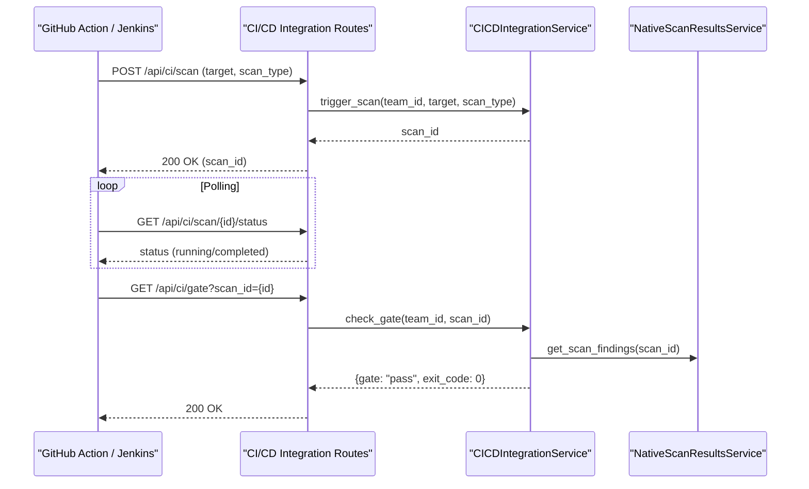

The OffloadSecurity CSPM platform utilizes a multi-layered testing strategy and a robust GitHub Actions-based CI/CD pipeline to ensure code quality, architectural integrity, and reliable deployments. The testing suite spans from AST-based architectural enforcement to asynchronous unit tests for the Celery-based scanning engine, AI security services, and CI/CD policy gates.

## CI/CD Pipeline Architecture

The platform's lifecycle is managed through the GitHub Action workflow, which handles Continuous Integration and Deployment to EC2 environments.

### CI/CD Workflow Data Flow
The following diagram illustrates the progression from code push to production deployment, including the service dependencies required for integration testing.

**CI/CD Pipeline Flow**
```mermaid
graph TD
    "Push/PR"["Code Push / PR"] --> "Lint"["🔍 Job 1: Lint & Quality"]
    
    subgraph "QualityChecks"
    "Lint" --> "Ruff"["Ruff (Python)"]
    "Lint" --> "Pylint"["Pylint (Python)"]
    "Lint" --> "ESLint"["ESLint (JS/React)"]
    end
    
    "QualityChecks" --> "Tests"["🧪 Job 2: Run Tests"]
    
    subgraph "TestEnvironment"
    "Tests" --> "Pytest"["Pytest (Backend)"]
    "Tests" --> "YarnTest"["Yarn Test (Frontend)"]
    "Pytest" -.-> "MongoDB"["mongo:7"]
    "Pytest" -.-> "Redis"["redis:7-alpine"]
    end
    
    "Tests" --> "Build"["🏗️ Job 3: Build & Package"]
    "Build" --> "Deploy"["🚀 Job 4: Deploy to EC2"]
    
    "Pytest" --> "Codecov"["📊 Coverage Upload"]
```

### Key Pipeline Components
*   **Environment**: Uses Python 3.12 and Node 20.
*   **Linting**: Employs `ruff` for Python linting and `pylint` for deep code quality analysis of `core/`, `services/`, and `routes/`.
*   **Services**: Backend tests run against live containers for MongoDB and Redis to validate repository and caching layers.
*   **Coverage**: Coverage reports are generated via `pytest-cov` and uploaded to Codecov.

---

## Architectural Enforcement: Scan Storage Contract

A critical component of the testing suite is the **Scan Storage Contract** test. This is a machine-enforceable architectural constraint that prevents "data siloing" by ensuring all scan results are persisted through a single canonical service.

### Implementation Details
The Scan Storage Contract test uses the Python `ast` (Abstract Syntax Tree) module to parse every route, service, and task file. It identifies any direct calls to MongoDB mutating methods (e.g., `insert_one`, `update_many`, `bulk_write`) on collections that are not explicitly allow-listed.

**Contract Enforcement Logic**
```mermaid
graph TD
    "ASTParser"["ast.parse()"] --> "TargetFiles"["_ROUTE_GLOBS"]
    "TargetFiles" --> "RouteFiles"["Scan Route Files"]
    "TargetFiles" --> "TaskFiles"["Scan Task Files"]
    "TargetFiles" --> "SvcFiles"["Scan Orchestration Service Files"]
    
    "ASTParser" --> "CheckMethod"{"Is Mutating Method?"}
    "CheckMethod" -- "Yes" --> "CheckAllowList"{"In ALLOWED_DIRECT_WRITE_COLLECTIONS?"}
    
    "CheckAllowList" -- "No" --> "Fail"["❌ Fail CI: Direct Write to Legacy Collection"]
    "CheckAllowList" -- "Yes" --> "Pass"["✅ Pass: Metadata/Audit Write"]
    
    "Pass" --> "Rule"["Rule: Must use NativeScanResultsService.store_scan_result"]
```

---

## Unit & Integration Testing

The platform utilizes `pytest` and `pytest-asyncio` for comprehensive backend testing, using `AsyncMock` to simulate database interactions.

### Authentication & Security Middleware
Tests for the `AuthService` validate the security of the identity layer:
*   **Password Hashing**: Verifies PBKDF2 salt uniqueness and verification logic in `TestPasswordHashing`.
*   **Registration**: Validates that the first user becomes an `ADMIN` and prevents duplicate email registration.
*   **Security Middleware**: Validates that rate limits and security headers are correctly applied.
*   **Rate Limiting Logic**: The `RateLimiter` is tested for endpoint-specific rules (e.g., stricter limits for `/api/auth/login`) and IP-based client ID generation.

### CI/CD Policy Gate & Webhook Security
The platform includes specific tests for CI/CD integration and webhook safety:
*   **Policy Gates**: The `CICDIntegrationService` is tested for its ability to evaluate "Pass/Fail" results based on severity thresholds and CISA KEV status.
*   **Webhook Security**: Webhook security tests ensure that HMAC signatures are verified and SSRF protections prevent targeting internal IP ranges during webhook delivery.

### Container & Cloud Security Integration
Integration tests validate the scanning and policy enforcement layers:
*   **Container Security**: Container security tests verify SBOM generation with Syft and vulnerability scanning with Grype using mocked tool outputs.
*   **GCP Org Scanning**: Hierarchical scanning tests (Phase 3) validate the multi-layer approach combining Cloud Asset Inventory and Prowler checks across an entire organization.

---

## CI/CD Pipeline Integration API

The platform provides a dedicated API for external CI/CD pipelines to trigger scans and check quality gates.

### Trigger & Gate Flow
External pipelines use API keys to interact with the CI/CD scan and integration routes.

**CI/CD API Interaction**


---

## Build & Runtime Validation

The build validation script (often used in the Docker build process) provides a dual-mode verification system to ensure the environment is correctly configured before deployment.

**System Integrity Check Flow**
```mermaid
graph TD
    "Validator"["Build Validator"] --> "BuildMode"["Build-time (Dockerfile)"]
    "Validator" --> "RuntimeMode"["Runtime (server startup)"]
    
    subgraph "BuildChecks"
    "BuildMode" --> "SCF"["check_scf_data()"]
    "BuildMode" --> "Routes"["check_routes()"]
    "BuildMode" --> "Deps"["check_critical_deps()"]
    end
    
    subgraph "RuntimeChecks"
    "RuntimeMode" --> "Mongo"["check_mongodb()"]
    "RuntimeMode" --> "Redis"["check_redis()"]
    "RuntimeMode" --> "Encrypt"["check_encryption_key()"]
    "RuntimeMode" --> "Docker"["check_docker()"]
    end
    
    "BuildChecks" -- "Fail" --> "AbortBuild"["❌ Build Fails"]
    "RuntimeChecks" -- "Fail" --> "LogWarning"["⚠️ Log Degradation"]
```

---

## Test Report Structure

| Test Category | Tooling | Key Entities Tested |
| :--- | :--- | :--- |
| **Architectural** | AST + Pytest | `Scan Storage Contract`, `Repository Pattern` |
| **Unit** | Pytest-Asyncio | `AuthService`, `RateLimiter`, `CICDIntegrationService` |
| **Integration** | TestClient + Mock | `Container Security`, `GCP Org Onboarding`, `GitHub App Webhooks` |
| **CI/CD Gates** | API Key + Pytest | `check_gate`, `trigger_scan`, `SARIF Export` |
| **Cloud Security** | Mock SDKs | `GCP Organization Discovery`, `Prowler Layered Scanning` |

---