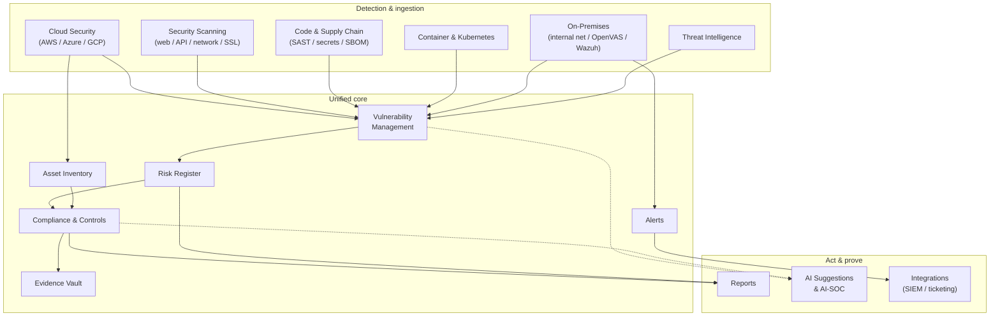

# Platform at a Glance

Offload Security is organized into modules that each own a domain of security work — and all feed the same correlated data model, or **[data lake](./unified-data-layer.md)**. This page is a map: what each module does, and where to read more.

## How the modules connect

Findings from every source converge in **Vulnerability Management**, resolve against the **Asset Inventory**, promote into the **Risk Register**, update **Compliance** controls, and generate **Evidence** and **Reports** — with **AI** assisting throughout and **Integrations** pushing to the systems you already run.

## The modules

### Detection & scanning

| Module | What it does | Read more |
|---|---|---|
| **Cloud Security (CSPM)** | Continuous misconfiguration assessment of AWS, Azure, and GCP, with native findings ingestion and drift detection. | [Cloud Security](../cloud-security/index.md) |
| **Application Security** | Web (OWASP ZAP, Nuclei), API, network (Nmap), and SSL/TLS testing of your applications and services. | [Security Scanning](../security-scanning/index.md) |
| **SAST & Code Security** | Static analysis, secrets detection, and IaC scanning of your source and pipelines. | [API & Code Scanning](../security-scanning/api-code-scanning.md) |
| **SBOM & License Scanning** | Software bill-of-materials generation and open-source **license compliance** across code and container images. | [Container Security](../security-scanning/container-security.md) |
| **Container Security** | Image scanning across ECR, GCR, ACR, and Docker Hub, with SBOMs, signature verification, and layer secret detection. | [Container Security](../security-scanning/container-security.md) |
| **Kubernetes Security** | Cluster scanning (kube-bench, Polaris, Kubescape, Trivy) mapped to the MITRE ATT&CK Container Matrix. | [Kubernetes Security](../security-scanning/kubernetes-security.md) |
| **On-Premises Scanning** | Internal network visibility, private URL/API scanning, OpenVAS vulnerability scanning, and Wazuh endpoint/SIEM data — for assets that never leave your network. | [On-Premises](../on-premises/index.md) |

### Unify, prioritize & govern

| Module | What it does | Read more |
|---|---|---|
| **Vulnerability Management** | The unified queue: triage, risk scoring, deduplication, SLA tracking, and remediation guidance across every source. | [Vulnerability Management](../vulnerability-risk/vulnerability-management.md) |
| **Asset Inventory** | A live catalog of resources across clouds, accounts, regions, and the internal network. | [Asset Inventory](../cloud-security/asset-inventory.md) |
| **Risk Register** | An enterprise risk register auto-minted from findings, with treatment plans and SLAs. | [Risk Register](../vulnerability-risk/risk-register.md) |
| **Compliance & GRC** | Framework tracking (SOC 2, ISO 27001, NIST CSF, PCI-DSS, and more), guided assessments, and drift detection. | [Compliance](../compliance/index.md) |
| **Evidence Management** | An auditable evidence vault, captured as work happens and mapped to controls. | [Evidence Hub](../compliance/evidence-hub.md) |
| **Alerts** | Centralized, deduplicated alerting across sources, routable to your notification and SIEM channels. | [Notifications](../integrations/notifications.md) |

### Act, prove & extend

| Module | What it does | Read more |
|---|---|---|
| **Reports** | Executive, compliance, and audit reports from live data in PDF, HTML, and Excel. | [Vulnerabilities & Risk](../vulnerability-risk/index.md) |
| **Knowledge Base** | A searchable store of policies, standards, and answers that powers questionnaire auto-fill and AI guidance. | [Knowledge Base](../ai-threat-intelligence/knowledge-base.md) |
| **AI Suggestions & AI-SOC** | AI-assisted triage, remediation guidance, control mapping, and incident correlation. | [AI-SOC Agents](../ai-threat-intelligence/ai-soc-agents.md) |
| **Threat Intelligence** | Multi-feed ingestion (CISA KEV, NVD, OTX) with IOC correlation against your assets. | [Threat Intelligence](../ai-threat-intelligence/threat-intelligence.md) |
| **SIEM & Integrations** | Two-way integration with SIEM/SOAR (Splunk, QRadar, Sentinel, Wazuh), ticketing, IR, and evidence systems. | [Integrations](../integrations/index.md) |

## Solutions by industry

Offload Security maps these modules to the outcomes specific sectors need — from PCI-DSS and audit evidence in **banking and financial services** to data-protection and internal-network coverage in **healthcare** and **manufacturing**. See **[Solutions by Industry](../industries/index.md)**.
