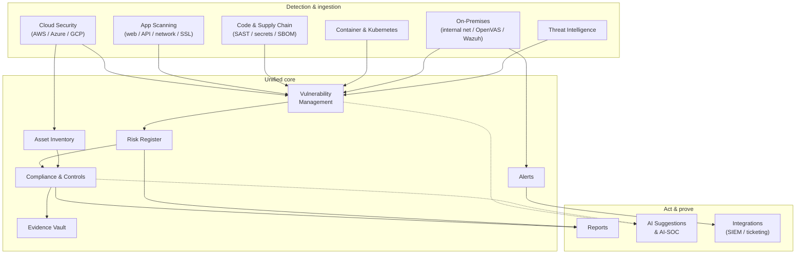

# Platform at a Glance

Offload Security is organized into modules that each own a domain of security work — and all feed the same correlated data model, or **[data lake](./unified-data-layer.mdx)**. This page is a map: what each module does, and where to read more.

## How the modules connect

```mermaid
flowchart TB
    subgraph Sources["Detection & ingestion"]
        CL["Cloud Security<br/>(AWS / Azure / GCP)"]
        SC["App Scanning<br/>(web / API / network / SSL)"]
        CODE["Code & Supply Chain<br/>(SAST / secrets / SBOM)"]
        CN["Container & Kubernetes"]
        ONP["On-Premises<br/>(internal net / OpenVAS / Wazuh)"]
        TI["Threat Intelligence"]
    end

    subgraph Core["Unified core"]
        VM["Vulnerability<br/>Management"]
        ASSET["Asset Inventory"]
        RISK["Risk Register"]
        COMP["Compliance & Controls"]
        EVID["Evidence Vault"]
        ALERT["Alerts"]
    end

    subgraph Outcomes["Act & prove"]
        REP["Reports"]
        AI["AI Suggestions<br/>& AI-SOC"]
        INT["Integrations<br/>(SIEM / ticketing)"]
    end

    CL --> VM & ASSET
    SC --> VM
    CODE --> VM
    CN --> VM
    ONP --> VM & ALERT
    TI --> VM
    VM --> RISK --> COMP --> EVID
    ASSET --> COMP
    ALERT --> INT
    COMP --> REP
    RISK --> REP
    VM -.-> AI
    COMP -.-> AI
```

Findings from every source converge in **Vulnerability Management**, resolve against the **Asset Inventory**, promote into the **Risk Register**, update **Compliance** controls, and generate **Evidence** and **Reports** — with **AI** assisting throughout and **Integrations** pushing to the systems you already run.

## The modules

### Detection & scanning

| Module | What it does | Read more |
|---|---|---|
| **Cloud Security (CSPM)** | Continuous misconfiguration assessment of AWS, Azure and GCP, identity and network analysis, real-time cloud events, a remediation queue. | [Cloud Security](../cloud-security/index.md) |
| **Application Security** | Web (OWASP ZAP, Nuclei), API, network (Nmap), and SSL/TLS testing of your applications and services. | [App & Infrastructure Scanning](../security-scanning/index.md) |
| **SAST & Code Security** | Static analysis, secrets detection, and IaC scanning of your source and pipelines. | [API & Code Scanning](../security-scanning/code/index.md) |
| **SBOM & License Scanning** | Software bill-of-materials generation and open-source **license compliance** across code and container images. | [Container Security](../security-scanning/containers/index.md) |
| **Container Security** | Registry discovery and image scanning across ECR, GCR / Artifact Registry, ACR, Docker Hub and private registries, with SBOMs and image policies. | [Container Security](../security-scanning/containers/index.md) |
| **Kubernetes Security** | Cluster onboarding and scanning, a fleet heat map, grouped findings and compliance reports. | [Kubernetes Security](../security-scanning/kubernetes/index.md) |
| **On-Premises** | The whole platform self-hosted; network and private URL/API scanning of internal targets, Wazuh endpoint telemetry synced in, Greenbone / OpenVAS connected — for assets that never leave your network. | [On-Premises](../on-premises/index.mdx) |

### Unify, prioritize & govern

| Module | What it does | Read more |
|---|---|---|
| **Vulnerability Management** | The unified queue: triage, risk scoring, deduplication, SLA tracking, and remediation guidance across every source. | [Vulnerability Management](../vulnerability-risk/vulnerability-management/index.mdx) |
| **Asset Inventory** | A live catalog of resources across clouds, accounts, regions, and the internal network. | [Asset Inventory](../cloud-security/asset-inventory.md) |
| **Risk Register** | An enterprise risk register auto-minted from findings, with treatment plans and SLAs. | [Risk Register](../vulnerability-risk/risk-management/index.md) |
| **Compliance & GRC** | Framework tracking (SOC 2, ISO 27001, NIST CSF, PCI-DSS, and more), guided assessments, and drift detection. | [Compliance](../compliance/index.md) |
| **Evidence Management** | An auditable evidence vault, captured as work happens and mapped to controls. | [Evidence Hub](../compliance/evidence-hub.md) |
| **Alerts** | Centralized, deduplicated alerting across sources, routed to Slack, Teams, email, PagerDuty and webhooks. | [Alerts](../vulnerability-risk/alerts.md) |

### Act, prove & extend

| Module | What it does | Read more |
|---|---|---|
| **Reports** | Executive dashboard, scheduled reports and a catalog of exports (PDF, HTML, Word, CSV, XLSX) from live data. | [Reports & AI](../reports-and-ai/index.md) |
| **Knowledge Base** | A searchable store of policies, standards, and answers that powers questionnaire auto-fill and AI guidance. | [Knowledge Base](../ai-threat-intelligence/knowledge-base.md) |
| **Security Command Center** | Agents that triage (rule-based, LLM-assisted when configured), prepare fixes, correlate incidents and answer posture questions; an approval-gated Auto-Fix Engine. | [Security Command Center](../ai-threat-intelligence/ai-soc-agents.md) |
| **Threat Intelligence** | Nine curated feeds (CISA KEV, URLhaus, OTX, Feodo Tracker, PhishTank and more) fetched hourly, IOC correlation against your assets, KEV-weighted CVE prioritisation, ATT&CK coverage. | [Threat Intelligence](../ai-threat-intelligence/threat-intelligence.md) |
| **Integrations** | Slack, Teams, email and PagerDuty for alerts; Jira two-way ticketing; Wazuh, SonarQube and Jenkins pulling data in; signed webhook subscriptions for any SIEM or automation. | [Integrations](../integrations/index.md) |

## Solutions by industry

Offload Security maps these modules to the outcomes specific sectors need — from PCI-DSS and audit evidence in **banking and financial services** to data-protection and internal-network coverage in **healthcare** and **manufacturing**. See **[Solutions by Industry](../industries/index.md)**.
