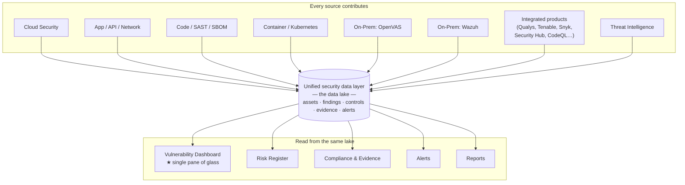

# The Data Lake & Single Pane of Glass

Everything in the previous pages rests on one architectural idea: **every module writes to, and reads from, a shared security data layer — a data lake — and the Vulnerability Dashboard renders it as a single pane of glass.** This is what makes Offload Security a *platform* rather than a bundle of tools that happen to share a login.

## One data lake underneath everything

As findings are produced — a cloud misconfiguration, a container CVE, a web-app vulnerability, a code issue, an internal-host finding from OpenVAS, an endpoint event from Wazuh — they are **normalized into a common model and stored in one unified data layer.** Assets, findings, controls, evidence, alerts, and threat intelligence all live in that same correlated store, keyed to a shared notion of *what the asset is* and *what the finding is*.

Because the data lake is the common substrate:

- **No module owns its own island of data.** A scanner doesn't keep its results to itself; it contributes them to the lake, where every other module can use them.
- **The same finding is one record**, whether it was seen once or a thousand times, and whether one scanner found it or three did.
- **Adding a source enriches the whole platform**, not just one screen — connect a new scanner or cloud account and its data immediately participates in risk, compliance, reporting, and correlation.

## Every module is interlinked

Because they share the data lake, the modules are **interconnected by design** — the output of one is the input of the next:

A vulnerability resolves against an **asset**; the asset carries its **cloud, container, or on-prem context**; the finding promotes into the **[Risk Register](../vulnerability-risk/risk-register.md)**; the risk maps to a **[compliance control](../compliance/index.md)**; the control accrues **[evidence](../compliance/evidence-hub.md)**; and **[threat intelligence](../ai-threat-intelligence/threat-intelligence.md)** re-scores it as the outside world changes — all without an analyst re-keying anything between systems.

## The Vulnerability Dashboard is the single pane of glass

The **[Vulnerability Dashboard](../vulnerability-risk/vulnerability-management.md)** is where the data lake becomes visible and actionable. It is not "the cloud scanner's results" or "the code scanner's results" — it is **every finding from every source, in one queue**, deduplicated, risk-scored, and tracked to closure:

- **Native modules** — Cloud Security, application/API/network scanning, SAST and code, SBOM/license, container and Kubernetes, and on-prem OpenVAS all land here.
- **On-prem telemetry** — host and endpoint findings from Wazuh contribute to the same view.
- **Integrated third-party products** — this is a crucial point: **when you connect an external scanner or security product, its findings are captured into the Vulnerability Dashboard too.** Results from tools like Qualys, Tenable, Rapid7, Snyk, SonarQube, Checkmarx, Veracode, GitHub CodeQL, AWS Security Hub, and others don't stay stranded in their own consoles — they flow into the lake and appear alongside everything else, deduplicated against native findings.

The result is a genuine single pane of glass: one place where a team can see **all** of its vulnerability exposure — from the platform's own scanners *and* from the tools it already runs — instead of logging into each product to assemble the picture by hand.

:::tip Why "single pane of glass" is more than a slogan here
Many tools claim a single pane by *linking out* to other consoles. Offload Security is different: the data itself is ingested into a shared lake and normalized, so the Vulnerability Dashboard shows a unified, deduplicated, comparable list — not a directory of other dashboards. One severity scale, one asset identity, one queue.
:::

## Why this matters

- **Complete exposure, in one view.** You see your true vulnerability posture across cloud, on-prem, code, and every connected tool — not a per-product slice.
- **No duplicated triage.** The same issue found by two scanners is one record, triaged once.
- **Consolidation without rip-and-replace.** Keep the scanners you rely on; Offload Security unifies their output rather than forcing you to abandon them. See **[Integrations](../integrations/third-party.md)**.
- **Governance flows automatically.** Because everything shares the lake, risk, compliance, evidence, and reporting stay current as findings open and close — the whole point of **[centralized ingestion](../on-premises/centralized-ingestion.md)**.

---

In short: the data lake is the foundation, the interlinked modules are the structure, and the **Vulnerability Dashboard is the window** — one pane of glass onto everything, including the products you've already integrated.
