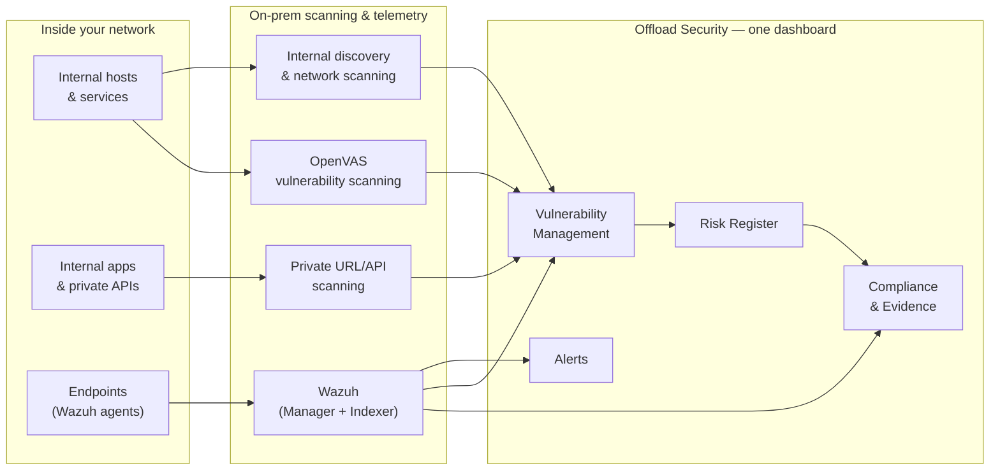

# On-Premises & Private Infrastructure

Cloud-native security tools stop at the cloud's edge. But most enterprises — and nearly every regulated one — still run business-critical systems on **private infrastructure**: internal applications, databases, file servers, OT and IoT devices, and employee endpoints that never touch a public IP. That footprint is where a great deal of real risk lives, and it is exactly what pure-SaaS scanners cannot see.

Offload Security closes that gap. The same platform that assesses your cloud reaches **inside your network** to discover internal assets, scan private applications and APIs, run vulnerability scans against internal hosts, and ingest endpoint and SIEM telemetry — and it lands all of it in the **same unified dashboard** as your cloud, code, and container posture.

:::tip One platform, both worlds
You don't run a separate on-prem product with its own console. Internal-network findings, OpenVAS vulnerability results, and Wazuh security events are correlated alongside cloud and application posture in one place — one inventory, one risk register, one compliance view.
:::

## What the on-premises model covers

| Capability | What it gives you | Read more |
|---|---|---|
| **Internal network visibility** | Discovery and continuous monitoring of assets living behind the firewall — hosts, services, and internal apps that cloud tools never see. | [Internal Network Visibility](./internal-network-visibility.md) |
| **Private infrastructure & internal URL/API scanning** | Security testing of internal web apps, private APIs, and services that are only reachable inside your network. | [Private Infrastructure Scanning](./private-infrastructure-scanning.md) |
| **OpenVAS vulnerability scanning** | Authenticated and unauthenticated vulnerability scanning of internal hosts and private environments, with results flowing into Vulnerability Management. | [OpenVAS Scanning](./openvas-scanning.md) |
| **Wazuh endpoint & SIEM visibility** | Endpoint (agent) security data, security events, alerts, vulnerability state, file-integrity monitoring, and compliance checks — in a customized in-platform dashboard. | [Wazuh Integration](./wazuh-integration.md) |
| **Centralized ingestion** | All of the above, plus cloud and application data, unified into one correlated source of truth and one dashboard. | [Centralized Ingestion](./centralized-ingestion.md) |

## Why organizations need it

- **Data residency and sovereignty.** Regulated sectors often cannot send security telemetry to a third-party SaaS. On-prem scanning and ingestion keep sensitive data inside your boundary while still giving leadership a unified view.
- **Coverage that matches reality.** A posture picture that omits the internal network is, by definition, incomplete — and it's usually the part auditors and attackers care about most.
- **No second silo.** Running separate on-prem tools re-creates the very fragmentation you're trying to escape. Bringing internal and cloud data into one platform is what makes the picture trustworthy.
- **Governance across the whole estate.** Internal-asset vulnerabilities, endpoint events, and compliance checks feed the same risk register and evidence vault as everything else, so governance spans cloud *and* on-prem.

## How it fits together

The internal scanning engines and Wazuh run **where your assets are** — inside your network — while the platform correlates their output with cloud and application posture. The result is a single dashboard that finally reflects your *whole* environment.

## Deployment shapes

The on-premises model supports common enterprise topologies — hybrid (cloud posture in the platform, internal scanning inside your network), fully self-hosted, and restricted/segmented networks. For deployment mechanics, prerequisites, and operations, see **[Deployment](../infrastructure/deployment.md)**.

Continue to **[Internal Network Visibility](./internal-network-visibility.md)** to see how discovery and monitoring work behind the firewall.
