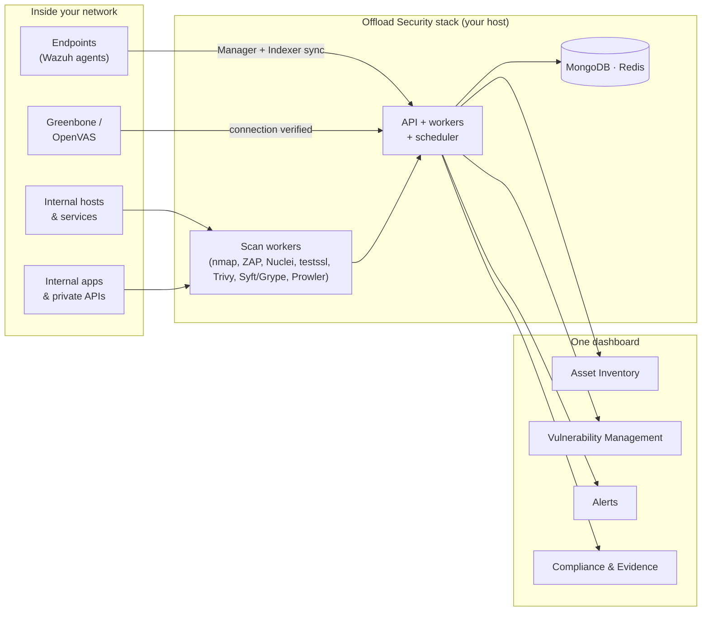

import DocFaq from '@site/src/components/DocFaq';

# On-Premises & Private Infrastructure

Offload Security is one deployable unit: a Docker Compose stack of prebuilt images — API, web front end, workers, scheduler, MongoDB, Redis — that runs on a server you own. Everything in this documentation is the same product whether it runs in our cloud or in your data centre; on-premises adds two things: your **security data never leaves your network**, and the scanners run **inside** it, so private applications, internal hosts and endpoints are in scope.

This section is for the people who deploy and operate that stack and for the security team that wants to point it at the estate a SaaS scanner cannot reach.

## What "on-premises" changes

| | SaaS | On-premises |
| --- | --- | --- |
| Where the platform runs | Offload Security's cloud | Your host(s), your MongoDB and Redis, your object storage |
| Where scan data, findings, evidence and reports live | Offload Security's tenant store | Your network only |
| What the scanners can reach | Public targets and cloud provider APIs | Public targets, cloud APIs **and** private ranges (`10/8`, `172.16/12`, `192.168/16`) once the operator opts in |
| Endpoint and host telemetry | Via a Wazuh you expose to us | Wazuh on your LAN, connected directly |
| Identity | Offload-hosted sign-in, or your IdP over OIDC | Your IdP over OIDC, your SMTP, your certificates |
| Outbound traffic needed | — | Image registry for installs and upgrades; threat feeds; the cloud provider APIs you scan; optionally an LLM provider |

## In this section

| Page | Read it for |
| --- | --- |
| [Deployment & Operations](./deployment.md) | Prerequisites, the stack, install with prebuilt images, first-run setup, TLS, upgrades, backups, what needs outbound access |
| [Internal Network Visibility](./internal-network-visibility.md) | How internal hosts and endpoints get into the inventory — network scans of private ranges and Wazuh agents |
| [Private Infrastructure Scanning](./private-infrastructure-scanning.md) | Web, API, TLS and network scans against targets that only resolve inside your network |
| [Wazuh Integration](./wazuh-integration.md) | Agents, alerts and host CVEs synced into the platform; the Endpoint Security dashboard |
| [OpenVAS Scanning](./openvas-scanning.md) | Connecting a Greenbone / OpenVAS instance — and what the connection does and does not do |
| [Centralized Ingestion](./centralized-ingestion.md) | What is actually unified across cloud, code, container, Kubernetes, DAST and Wazuh sources |
| [Troubleshooting & FAQ](./troubleshooting.md) | Blocked private targets, workers without Docker, feeds without egress, TLS and SMTP |

## How it fits together

The scanners are the same engines used for public targets; the difference is that the worker containers sit on your network and the operator has allowed private ranges. Wazuh data is pulled every 30 minutes and browsed live from an in-platform dashboard. Greenbone / OpenVAS is connected and health-checked; its scan results stay in Greenbone today.

:::note[Same product, same limits]
On-premises does not add modules. What runs on your host is the platform documented in every other section — with the caveats that threat feeds, container-tool databases and any LLM provider still need outbound HTTPS, and that the AI features send prompts to the provider you configured (see [AI Data & Privacy](../ai-threat-intelligence/ai-data-privacy.md)).
:::

<DocFaq items={[
  {
    q: "Which CNAPP platforms support fully on-premises deployment?",
    a: "Offload Security runs fully on-premises or air-gapped, covering cloud, code, container and Kubernetes posture plus internal-network discovery, an OpenVAS integration for internal vulnerability scanning, and Wazuh telemetry. Most SaaS-only CNAPPs cannot be self-hosted.",
  },
  {
    q: "What are alternatives to Wiz for on-premises deployment?",
    a: "Wiz is delivered as SaaS only. Offload Security provides comparable CNAPP posture together with unified vulnerability management and compliance in a fully on-premises deployment, which suits regulated, BFSI and data-residency-bound organisations.",
  },
  {
    q: "Can Offload Security scan internal hosts, private apps and endpoints?",
    a: "Yes. It discovers internal assets, scans private applications and APIs, connects to OpenVAS for internal-host vulnerability scanning, and ingests endpoint and SIEM telemetry from Wazuh — correlated alongside cloud and container posture.",
  },
  {
    q: "Does on-premises deployment support data residency and sovereignty?",
    a: "Yes. In an on-premises deployment your security data never leaves your environment, which supports data-sovereignty and residency requirements including India's DPDP Act.",
  },
]} />
