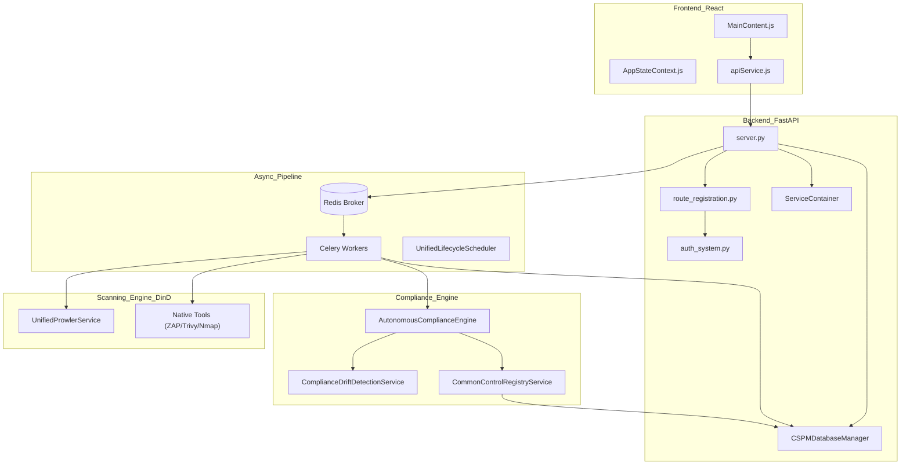
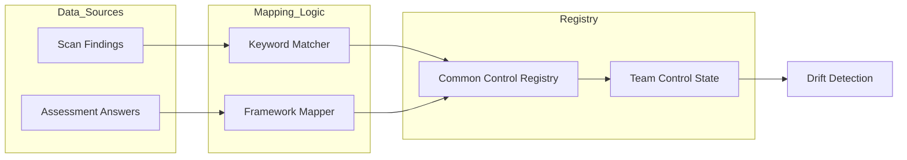

This page describes the high-level design of the OffloadSecurity CSPM platform. The system is built as a modular monolith using **FastAPI** and **React**, supported by a robust asynchronous task engine, a multi-tenant MongoDB data layer, and an autonomous compliance engine.

## System Architecture Overview

The platform follows a traditional 3-tier architecture (Frontend, Backend, Database) but extends it with a **Docker-in-Docker (DinD)** scanning pattern and an asynchronous **Celery/Redis** pipeline for heavy security workloads.

### High-Level Component Diagram
The following diagram illustrates the flow from the user interface through the API layer to the scanning engines and autonomous compliance components, mapping natural language components to specific code entities.

**Sources:** `backend/server.py` `1-136`, `backend/core/database.py` `10-51`, `backend/services/dependency_injection.py` `35-142`, `backend/services/autonomous_compliance_engine.py` `1-11`.

---

## Backend: FastAPI & Modular Routing

The backend is a **FastAPI** application designed for high concurrency using Python's `asyncio`. 

### Key Architectural Patterns:
1.  **Centralized Route Registration**: Instead of declaring all routes in `server.py`, the platform uses `register_all_routes` to mount modular routers. This ensures that a failure in one security module does not prevent the entire platform from starting `backend/server.py:23-23`.
2.  **Service Container (DI)**: The `ServiceContainer` class manages service dependencies and provides clean dependency injection. It initializes repositories using `RepositoryFactory` and business logic services with proper repository dependencies `backend/services/dependency_injection.py:35-142`.
3.  **Structured Logging**: Production logs are emitted as JSON via `setup_structured_logging` to facilitate ingestion into ELK or Loki `backend/server.py:42-49`.
4.  **Native Tool Verification**: On startup, the system performs a comprehensive check for required binary tools (Docker, Nmap, Trivy) via `verify_native_tools_or_fail` to ensure the scanning environment is viable `backend/server.py:102-116`.
5.  **Observability**: The platform exposes Prometheus-compatible metrics via the `/metrics` endpoint, tracking request latency, error rates, and scan durations `backend/server.py:127-131`, `backend/services/platform_hardening_service.py:32-124`.

**Sources:** `backend/server.py` `1-136`, `backend/services/dependency_injection.py` `35-142`, `backend/services/platform_hardening_service.py` `32-124`.

---

## Data Layer: MongoDB Multi-Database Design

The platform utilizes a **Multi-Database Architecture** managed by the `CSPMDatabaseManager`. This provides logical isolation for different security domains and simplifies scaling.

### Database Registry
The `CSPMDatabaseManager` manages connections to distinct databases for each functional module `backend/core/database.py:39-51`:

| Module/Database | Environment Variable | Default Name |
| :--- | :--- | :--- |
| **Core/Platform** | `DB_NAME` | `cspm_platform` |
| **Cloud Security** | `CLOUD_SECURITY_DB_NAME` | `cspm_cloud_security` |
| **Risk Management** | `RISK_MANAGEMENT_DB_NAME` | `cspm_risk_management` |
| **Assessments** | `ASSESSMENT_DB_NAME` | `cspm_assessments` |
| **Container Security** | `CONTAINER_SECURITY_DB_NAME` | `cspm_container_security` |
| **AI Governance** | `AI_GOVERNANCE_DB_NAME` | `cspm_ai_governance` |
| **Security Scans** | `SECURITY_SCANS_DB_NAME` | `cspm_security_scans` |
| **Threat Intelligence** | `THREAT_INTELLIGENCE_DB_NAME` | `cspm_threat_intelligence` |
| **Orchestration** | `ORCHESTRATION_DB_NAME` | `cspm_orchestration` |

### Tenancy and Cross-Module References
The architecture enforces strict team-based data isolation. For example, `team_control_state` stores per-team implementation status for global SCF controls `backend/services/common_control_registry_service.py:7-10`. Cross-module relationships are handled via the `create_cross_module_reference` helper in the core database `backend/core/database.py:129-163`.

**Sources:** `backend/core/database.py` `10-163`, `backend/services/common_control_registry_service.py` `1-20`.

---

## Autonomous Compliance Engine

The `AutonomousComplianceEngine` continuously monitors compliance posture by auto-updating SCF (Secure Controls Framework) control status based on scan findings and assessment answers.

### Compliance Mapping & Drift
The engine utilizes a sophisticated mapping system to bridge the gap between technical findings and regulatory controls:
*   **Keyword Indexing**: Findings are tokenized and matched against control keywords using stem-style prefix matching `backend/services/autonomous_compliance_engine.py:41-108`.
*   **Drift Detection**: The `ComplianceDriftDetectionService` compares current state against snapshots to detect regressions, expired evidence, or threshold crossings `backend/services/compliance_drift_detection_service.py:7-12`.
*   **Cross-Framework Mapping**: The `ControlMappingEngine` allows an answer in one framework (e.g., ISO 27001) to auto-satisfy requirements in others (e.g., SOC 2) via the unified SCF registry `backend/services/control_mapping_engine.py:1-9`.

**Sources:** `backend/services/autonomous_compliance_engine.py` `1-11`, `backend/services/compliance_drift_detection_service.py` `7-12`, `backend/services/control_mapping_engine.py` `1-9`.

---

## Async Task System: Redis & Celery

The platform relies on **Celery** for long-running security scans and periodic maintenance tasks.

### Event Loop Management
A critical architectural pattern in the platform is the use of `CeleryDatabaseManager`. Because Celery workers use a `ForkPoolWorker` strategy, global database singletons become stale. The `CeleryDatabaseManager` ensures fresh connections are created for every task execution `backend/core/database.py:11-14`.

### Scan Orchestration
The `ScanOrchestrationService` coordinates between web, container, and cloud scanning modules. It utilizes Redis for caching scan status and Celery for distributed execution `backend/services/dependency_injection.py:132-140`.

**Sources:** `backend/core/database.py` `11-14`, `backend/services/dependency_injection.py` `132-140`.

---

## Microservices Migration Roadmap

The platform is architected to facilitate a transition from a modular monolith to a distributed microservices environment:
1.  **Database Decoupling**: Each security module already possesses its own database instance in MongoDB, managed via `CSPMDatabaseManager` `backend/core/database.py:39-51`.
2.  **Service Abstraction**: Business logic is encapsulated in services (e.g., `WebSecurityService`, `CloudSecurityService`) that are injected via the `ServiceContainer`, making them easy to move into standalone processes `backend/services/dependency_injection.py:87-100`.
3.  **Modular API Design**: Routers are prefixed and tagged by domain (e.g., `/common-controls`, `/compliance-engine`), allowing for easy routing at the API gateway level in the future `backend/routes/common_control_routes.py:25-25`, `backend/routes/autonomous_compliance_routes.py:42-42`.

**Sources:** `backend/core/database.py` `39-51`, `backend/services/dependency_injection.py` `87-100`, `backend/routes/common_control_routes.py` `25-25`.

---