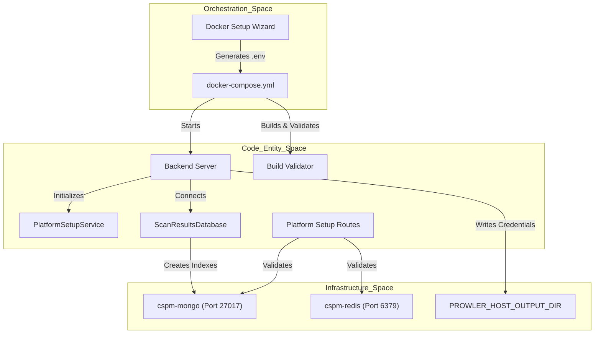
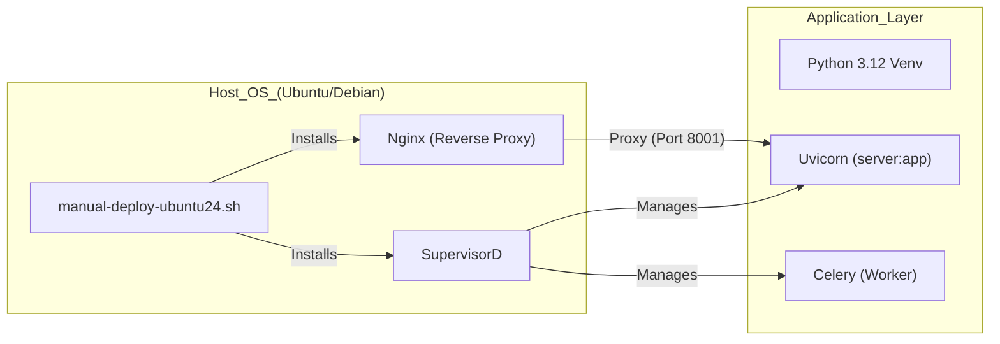

This page provides a technical guide for deploying and configuring the OffloadSecurity CSPM platform. The platform supports two primary deployment modes: a containerized stack using **Docker Compose** (recommended for production) and a **Bare-Metal** installation for specialized environments.

## Deployment Architecture

The platform follows a multi-service architecture coordinated via `docker-compose.yml`. The backend is built using a multi-stage `Dockerfile.backend` that ensures a lean runtime image while including necessary system dependencies like the Docker CLI, Syft, and Grype for container/SCA scanning.

The backend service orchestrates scans by launching sibling containers (Docker-in-Docker pattern). It requires access to the host's Docker socket, which is handled by mapping the socket and adjusting the `DOCKER_GID` to match the host group. For cloud security scans, the `UnifiedProwlerService` uses a bind-mounted directory `PROWLER_HOST_OUTPUT_DIR` to share credentials and artifacts between the worker and the Prowler container.

### Data Flow & Component Interaction
The following diagram illustrates the bootstrap and runtime connectivity flow during the setup process, associating system components with their code implementation.

**System Bootstrap & Connectivity Flow**

---

## Interactive Docker Setup

The primary entry point for deployment is the interactive `docker-setup.sh` wizard. This script automates environment validation, secret generation, and service orchestration.

### Key Functions
- **Pre-flight Checks**: Validates Docker and Docker Compose installations and detects the host Docker socket GID to ensure the `backend` container can launch sibling containers for scanning.
- **Secret Generation**: The script includes helpers to generate cryptographically secure hex keys, Base64 strings, and Fernet keys (`gen_fernet`) for sensitive configuration.
- **Environment Configuration**: Populates the `.env` file from `.env.example`, ensuring critical variables like `MONGO_ROOT_PASSWORD` and `REDIS_PASSWORD` are set.
- **Build Validation**: During the Docker build, the build validation step verifies that critical Python dependencies are present; the build fails if imports are missing.

### Setup Gate Middleware
The platform implements a `Setup Gate` via `configure_middleware`. This prevents access to the platform until configuration is complete.
- **Exemptions**: Routes like `/api/setup`, `/api/health`, and `/api/auth/login` are exempt from the gate.
- **Timeout Management**: The `TimeoutMiddleware` enforces strict limits, with specialized extensions for "upload-heavy" paths like `/api/code/upload-scan` (900s) and "slow" paths like `/api/cloud-scans/` (600s).

---

## Results Management & Storage

Once deployed, the platform manages scan data through specialized database services.

### Scan Results Storage
The `ScanResultsDatabase` class provides dedicated persistent storage for all security scan results.
- **Multi-DB Connectivity**: Upon connection, it initializes separate database instances for `cspm_security_scans`, `cspm_container_security`, and `cspm_cloud_security`.
- **Index Management**: Automatically creates unique indexes on `scan_id` and performance indexes on `user_id` and `created_at`.
- **Data Retention**: Implements TTL (Time-To-Live) indexes in MongoDB to auto-purge scan results older than the `CONTAINER_SCAN_RETENTION_DAYS` (default 180).

---

## Manual & Bare-Metal Installation

For deployments on Ubuntu 24.04 or Debian 12 without Docker, the `install.sh` and `manual-deploy-ubuntu24.sh` scripts provide idempotent installation paths.

### Installation Steps
1. **System Dependencies**: Installs core packages including `build-essential`, `libffi-dev`, `supervisor`, and `nginx`.
2. **Python 3.12**: Installs Python 3.12, configures a virtual environment, and ensures `pip` is available.
3. **Infrastructure**: Installs MongoDB 7.0 and Redis-server, enabling them via `systemctl`.
4. **Nginx Configuration**: The `nginx-ssl.conf.template` or `setup-nginx-single-server.sh` configures Nginx as a reverse proxy with specialized hardening.
    - **Security Headers**: Explicitly sets `X-Frame-Options`, `X-Content-Type-Options`, and `Content-Security-Policy`.
    - **Proxy Timeouts**: 900-second `proxy_read_timeout` to match the backend's `upload_heavy_timeout_seconds` for large code/API spec uploads.

**Bare-Metal Process Mapping**

---

## Environment Configuration (`.env`)

Critical platform behavior is controlled via environment variables. A template is provided in `.env.example`.

### Critical Variables
| Variable | Purpose |
| :--- | :--- |
| `MONGO_ROOT_PASSWORD` | Root password for MongoDB infrastructure |
| `REDIS_PASSWORD` | Authentication for Redis cache/broker |
| `SECRET_KEY` | JWT signing secret for sessions |
| `CLOUD_ENCRYPTION_KEY` | Fernet key for cloud credentials |
| `PROWLER_HOST_OUTPUT_DIR` | Host path for Prowler artifacts |
| `DOCKER_GID` | Host Docker group GID for socket access |

---