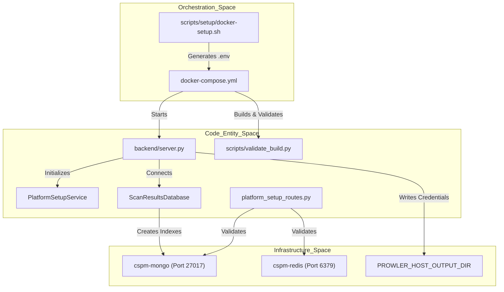
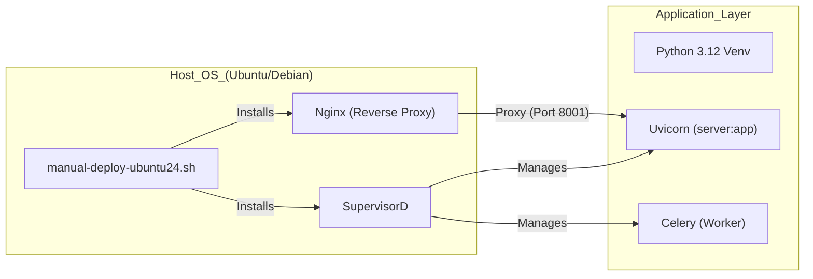

This page provides a technical guide for deploying and configuring the OffloadSecurity CSPM platform. The platform supports two primary deployment modes: a containerized stack using **Docker Compose** (recommended for production) and a **Bare-Metal** installation for specialized environments.

## Deployment Architecture

The platform follows a multi-service architecture coordinated via `docker-compose.yml` `docker-compose.yml:10-210`. The backend is built using a multi-stage `Dockerfile.backend` that ensures a lean runtime image while including necessary system dependencies like the Docker CLI, Syft, and Grype for container/SCA scanning `deployment/Dockerfile.backend:4-89`.

The backend service orchestrates scans by launching sibling containers (Docker-in-Docker pattern). It requires access to the host's Docker socket, which is handled by mapping the socket and adjusting the `DOCKER_GID` to match the host group `docker-compose.yml:127-136`. For cloud security scans, the `UnifiedProwlerService` uses a bind-mounted directory `PROWLER_HOST_OUTPUT_DIR` to share credentials and artifacts between the worker and the Prowler container `docker-compose.yml:120-132`.

### Data Flow & Component Interaction
The following diagram illustrates the bootstrap and runtime connectivity flow during the setup process, associating system components with their code implementation.

**System Bootstrap & Connectivity Flow**

Sources: `docker-compose.yml:10-202`, `backend/services/platform_setup_service.py:81-146`, `backend/core/scan_results_database.py:30-44`, `deployment/Dockerfile.backend:120-121`

---

## Interactive Docker Setup

The primary entry point for deployment is the interactive `docker-setup.sh` wizard. This script automates environment validation, secret generation, and service orchestration.

### Key Functions
- **Pre-flight Checks**: Validates Docker and Docker Compose installations and detects the host Docker socket GID to ensure the `backend` container can launch sibling containers for scanning `scripts/setup/docker-setup.sh:66-120`.
- **Secret Generation**: The script includes helpers to generate cryptographically secure hex keys, Base64 strings, and Fernet keys (`gen_fernet`) for sensitive configuration `scripts/setup/docker-setup.sh:159-166`.
- **Environment Configuration**: Populates the `.env` file from `.env.example`, ensuring critical variables like `MONGO_ROOT_PASSWORD` and `REDIS_PASSWORD` are set `docker-compose.yml:21-23`, `docker-compose.yml:72`.
- **Build Validation**: During the Docker build, `validate_build.py` verifies that critical Python dependencies are present; the build fails if imports are missing `deployment/Dockerfile.backend:24-32`.

### Setup Gate Middleware
The platform implements a `Setup Gate` via `configure_middleware` `backend/core/middleware_setup.py:159-170`. This prevents access to the platform until configuration is complete.
- **Exemptions**: Routes like `/api/setup`, `/api/health`, and `/api/auth/login` are exempt from the gate `backend/core/middleware_setup.py:142-153`.
- **Timeout Management**: The `TimeoutMiddleware` enforces strict limits, with specialized extensions for "upload-heavy" paths like `/api/code/upload-scan` (900s) and "slow" paths like `/api/cloud-scans/` (600s) `backend/core/middleware_setup.py:31-107`.

Sources: `scripts/setup/docker-setup.sh:1-200`, `backend/core/middleware_setup.py:139-153`, `deployment/Dockerfile.backend:18-32`

---

## Results Management & Storage

Once deployed, the platform manages scan data through specialized database services.

### Scan Results Storage
The `ScanResultsDatabase` class provides dedicated persistent storage for all security scan results `backend/core/scan_results_database.py:18-21`.
- **Multi-DB Connectivity**: Upon connection, it initializes separate database instances for `cspm_security_scans`, `cspm_container_security`, and `cspm_cloud_security` `backend/core/scan_results_database.py:35-38`.
- **Index Management**: Automatically creates unique indexes on `scan_id` and performance indexes on `user_id` and `created_at` `backend/core/scan_results_database.py:75-130`.
- **Data Retention**: Implements TTL (Time-To-Live) indexes in MongoDB to auto-purge scan results older than the `CONTAINER_SCAN_RETENTION_DAYS` (default 180) `backend/core/scan_results_database.py:95-104`.

Sources: `backend/core/scan_results_database.py:30-130`, `backend/core/container_registry_database.py:113-124`

---

## Manual & Bare-Metal Installation

For deployments on Ubuntu 24.04 or Debian 12 without Docker, the `install.sh` and `manual-deploy-ubuntu24.sh` scripts provide idempotent installation paths.

### Installation Steps
1. **System Dependencies**: Installs core packages including `build-essential`, `libffi-dev`, `supervisor`, and `nginx` `deployment/install.sh:91-103`.
2. **Python 3.12**: Installs Python 3.12, configures a virtual environment, and ensures `pip` is available `deployment/install.sh:108-166`.
3. **Infrastructure**: Installs MongoDB 7.0 and Redis-server, enabling them via `systemctl` `deployment/manual-deploy-ubuntu24.sh:150-198`.
4. **Nginx Configuration**: The `nginx-ssl.conf.template` or `setup-nginx-single-server.sh` configures Nginx as a reverse proxy with specialized hardening `deployment/nginx-ssl.conf.template:41-67`.
    - **Security Headers**: Explicitly sets `X-Frame-Options`, `X-Content-Type-Options`, and `Content-Security-Policy` `deployment/nginx-ssl.conf.template:61-67`.
    - **Proxy Timeouts**: 900-second `proxy_read_timeout` to match the backend's `upload_heavy_timeout_seconds` for large code/API spec uploads `deployment/nginx-ssl.conf.template:104-107`.

**Bare-Metal Process Mapping**

Sources: `deployment/manual-deploy-ubuntu24.sh:1-220`, `deployment/nginx-ssl.conf.template:93-115`, `deployment/install.sh:25-31`

---

## Environment Configuration (`.env`)

Critical platform behavior is controlled via environment variables. A template is provided in `.env.example`.

### Critical Variables
| Variable | Purpose | Code Reference |
| :--- | :--- | :--- |
| `MONGO_ROOT_PASSWORD` | Root password for MongoDB infrastructure | `docker-compose.yml:23` |
| `REDIS_PASSWORD` | Authentication for Redis cache/broker | `docker-compose.yml:72` |
| `SECRET_KEY` | JWT signing secret for sessions | `.env.example:39` |
| `CLOUD_ENCRYPTION_KEY` | Fernet key for cloud credentials | `.env.example:34` |
| `PROWLER_HOST_OUTPUT_DIR` | Host path for Prowler artifacts | `docker-compose.yml:120` |
| `DOCKER_GID` | Host Docker group GID for socket access | `docker-compose.yml:142` |

Sources: `.env.example:1-112`, `docker-compose.yml:21-142`, `backend/core/scan_results_database.py:24-25`

---