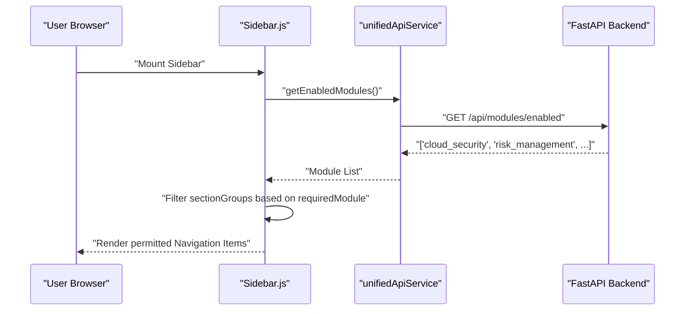
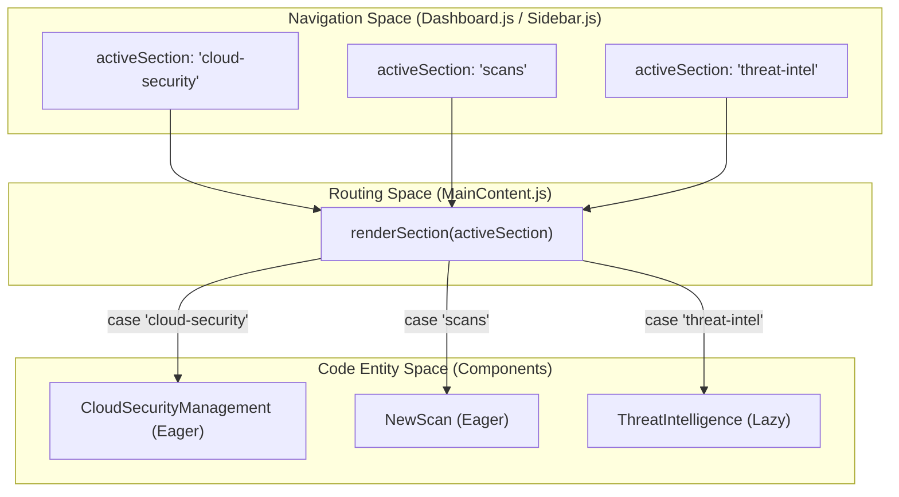

The OffloadSecurity platform utilizes a modular architecture designed for scalability and feature-flagged access control. This system enables the platform to dynamically enable or disable high-level security modules (e.g., Cloud Security, Risk Management, AI Governance) based on user subscriptions and organizational needs. Navigation is orchestrated through a centralized sidebar and a main content router that leverages React lazy loading to optimize performance.

## Modular Feature-Flag System

The platform's capabilities are governed by a modular licensing and permission system. The frontend synchronization with the backend occurs via the `unifiedApiService.getEnabledModules()` call within the `Sidebar` component `frontend/src/components/Sidebar.js:53`.

### Module Authorization and Initialization
- **Module Source of Truth**: The `ALL_PLATFORM_MODULES` constant in the frontend defines the comprehensive list of available modules, including `vulnerability_scanning`, `cloud_security`, `risk_management`, and `ai_security` `frontend/src/components/Sidebar.js:6-22`.
- **Dynamic Filtering**: The list of enabled modules is stored in the `enabledModules` state. If the API call fails, the system defaults to the full list to ensure availability `frontend/src/components/Sidebar.js:60-65`.
- **Module Loading Configuration**: The `ModuleLoader.js` utility defines which modules load `immediate` (e.g., `overview`) and which load `lazy` (e.g., `threat-intelligence`, `cloud-security`) `frontend/src/core/modules/ModuleLoader.js:38-56`.

**Data Flow: Module Authorization**

**Sources:**
- `frontend/src/components/Sidebar.js:6-69`
- `frontend/src/core/modules/ModuleLoader.js:38-66`

---

## Sidebar & Navigation Structure

The `Sidebar.js` component defines the primary navigation hierarchy. Sections are organized into logical groups, each potentially requiring specific module permissions.

### Navigation Groups
The platform categorizes security features into functional groups `frontend/src/components/Sidebar.js:72-232`:

| Group ID | Group Name | Key Sections | Required Module |
| :--- | :--- | :--- | :--- |
| `core_security` | CORE SECURITY | Dashboard, AI SOC, Scanning, Code Command Center | `vulnerability_scanning` |
| `cloud_infrastructure` | CLOUD & INFRASTRUCTURE | Cloud Security, Containers, K8s, Asset Inventory | `cloud_security` |
| `compliance_risk` | COMPLIANCE & RISK | Compliance Posture, Risk Management, Assessments | `risk_management` / `compliance_assessments` |
| `threat_intelligence` | THREAT & INTELLIGENCE | Threat Intel, AI Governance, Knowledge Base | `threat_intelligence` |

### Implementation Logic
Each navigation item in the `sectionGroups` array contains a `requiredModule` property `frontend/src/components/Sidebar.js:77-215`. The rendering logic checks if the `requiredModule` is either `null` or present in the `enabledModules` list. 

The `Sidebar` also fetches dashboard statistics (`getDashboardStats`) and AI insights (`getAiInsights`) in parallel during its initialization to populate UI badges `frontend/src/components/Sidebar.js:50-52`.

**Sources:**
- `frontend/src/components/Sidebar.js:5-232`

---

## MainContent Routing & Lazy Loading

`MainContent.js` serves as the dynamic routing hub for the authenticated dashboard. It utilizes React's `lazy` and `Suspense` APIs to implement code-splitting, reducing the initial bundle size by loading security modules only when requested.

### Implementation Details
- **Eager Loading**: Critical components used on initial render or frequently accessed are imported traditionally. These include `NewScan`, `CreateAssessment`, and `CloudSecurityManagement` `frontend/src/components/MainContent.js:10-13`.
- **Lazy Loading**: Secondary modules are loaded on-demand. For example, `ThreatIntelligence`, `KnowledgeBase`, and `EnhancedRiskManagement` are defined as lazy components `frontend/src/components/MainContent.js:23-75`.
- **Loading State**: A `LazyFallback` component renders a spinner during chunk retrieval `frontend/src/components/MainContent.js:16-20`.

**Component Mapping & Entity Space**

### Module Navigation & State Management
When a user selects a section in the `Sidebar`, the `onSectionChange` callback triggers `handleSectionChange` in `Dashboard.js` `frontend/src/components/Dashboard.js:54-89`. This updates the URL with the `section` parameter and increments a `sectionResetKey` to force-refresh child components `frontend/src/components/Dashboard.js:85`.

Several modules implement internal sub-navigation:
- **CloudSecurityManagement**: Uses `activeCloudTab` to switch between `accounts`, `compliance`, `findings`, and `inventory` `frontend/src/components/cloud/CloudSecurityManagement.js:27-121`.
- **Dashboard.js**: Synchronizes URL parameters (`section`, `tab`, `action`) with component state to allow deep-linking `frontend/src/components/Dashboard.js:21-52`.

### Authentication & Setup Guarding
Navigation is protected by the `ProtectedRoute` component, which verifies both the `user` session via `AuthContext` and the platform's initialization status via the `/setup/status` endpoint `frontend/src/components/ProtectedRoute.js:6-67`.

**Sources:**
- `frontend/src/components/MainContent.js:1-75`
- `frontend/src/components/Dashboard.js:9-147`
- `frontend/src/components/cloud/CloudSecurityManagement.js:27-121`
- `frontend/src/components/ProtectedRoute.js:6-67`
- `frontend/src/AuthContext.js:39-109`

---