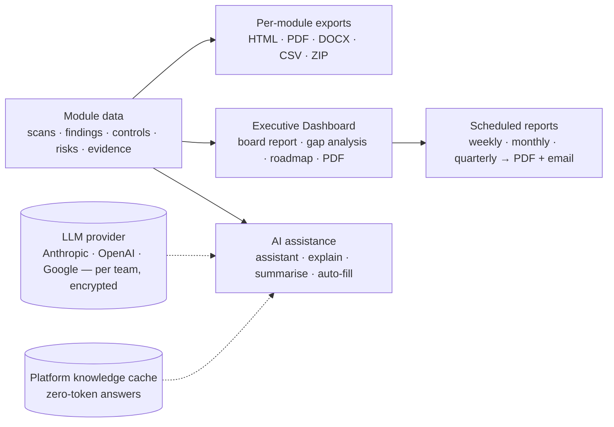

# Reports & AI Assistance

Every module in Offload Security writes to one normalised data layer, and that is what makes reporting boring in the right way: the board pack, the auditor's CSV and the engineer's per-scan PDF all come from the same numbers you see on screen. AI sits on top of the same data — to explain, summarise and draft, never to decide.

**Where:** reports are generated where their data lives (each module's page) and from the **Executive Dashboard** (Dashboard → *Executive Dashboard* tab); the **AI Security Assistant** is the floating button on every page; AI configuration lives under **Knowledge Base → AI Assistant**.

## What this section covers

| Page | What it is for |
| --- | --- |
| [Executive Dashboard](./executive-dashboard.md) | The leadership view — per-framework readiness, priority gaps, gap analysis, a remediation roadmap, board report and PDF export |
| [Scheduled Reports](./scheduled-reports.md) | Weekly / monthly / quarterly executive reports rendered to PDF, emailed to recipients and kept in history |
| [Report Catalog](./report-catalog.md) | Every export in the platform, by module — format, where to click, the API route, retention |
| [AI Assistant](./ai-assistant.md) | The floating security assistant, the in-context AI features across modules, provider setup, caching and data handling |
| [API](./api.md) · [Troubleshooting & FAQ](./troubleshooting.md) | Endpoint map and the common problems |

## How reporting fits together

Three properties hold everywhere:

- **Reports are team-scoped.** A report contains the active team's data only; switch teams before generating a report for another business unit.
- **Reports are generated from live data and kept.** Generated artefacts are stored with a retention window (180 days by default) so the version you sent to the auditor is the version you can download again.
- **AI answers only from data your team can already see**, and only *generic* questions are ever served from a shared cache — nothing derived from your tenant is.

## Start here

1. **Open the Executive Dashboard** once your frameworks are active — it is populated from the same scorer as Compliance Posture, so if the posture page is right, this is right. See [Executive Dashboard](./executive-dashboard.md).
2. **Schedule the board report** monthly to the people who ask for it. See [Scheduled Reports](./scheduled-reports.md).
3. **Find the export you need** in the [Report Catalog](./report-catalog.md) — most questions are answered by a report that already exists.
4. **Configure an LLM provider** (Knowledge Base → AI Assistant → *AI Configuration*) to switch on the assistant and the in-context AI features; without one, every AI button explains what it would do and asks for a provider. See [AI Assistant](./ai-assistant.md#configure-a-provider).

## Related

- [Compliance → Audit Reports](../compliance/audit-reports.md) — the audit CSV packs.
- [Compliance → Evidence Hub](../compliance/evidence-hub.md#auditor-package) — per-framework auditor packages.
- [Knowledge Base & AI Assistant](../ai-threat-intelligence/knowledge-base.md) — document Q&A and questionnaire auto-fill.
- [Trust & Security](../trust-and-security.md#how-ai-features-handle-your-data) — the data-handling commitments behind the AI features.
