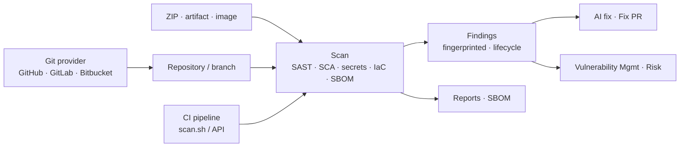

# Code Command Center

The Code Command Center is where source code gets tested before it becomes a running system: static analysis, vulnerable dependencies, leaked secrets, infrastructure-as-code mistakes, and the licences you are shipping. Connect a Git provider once, then scan repositories on demand, on a schedule, or from every pipeline run — and work the findings with a lifecycle that survives re-scans.

**Where:** left navigation → **Code Command Center**.

## What you get

| Scan type | Engine | Finds |
| --- | --- | --- |
| **SAST** | OpenGrep + Bandit (+ SonarQube when connected) | Injection, insecure deserialization, weak crypto, dangerous calls — per file and line, with code context |
| **Dependency / SCA** | OSV.dev, enriched with CISA KEV and EPSS | Vulnerable packages across lockfiles (npm, pip, Go, Maven, …), with fixed versions and exploit-likelihood signals |
| **Secrets** | Gitleaks | API keys, tokens, passwords and private keys in code and config |
| **IaC** | Checkov | Terraform, CloudFormation, Kubernetes manifests, Dockerfiles — public buckets, open security groups, unencrypted storage |
| **SBOM & Licences** | Syft (CycloneDX), licence enrichment via deps.dev | Component inventory, licence families and obligations, policy-pack checks |
| **Compiled Image Scan** | Trivy + Grype | The Docker image a pipeline just built |

**Full Code Security** runs all of the above in one pass.

## The workspace

| Tab | Use it to | Page |
| --- | --- | --- |
| **Overview** | Repository coverage — scanned, scheduled, uncovered, stale (no push in 90 days) — and findings by severity. | *this page* |
| **New Scan** | Scan a repository, an uploaded ZIP, a build artifact or a compiled image. | [Running Code Scans](./running-code-scans.md) |
| **Findings** | Triage across repositories: SAST, secrets, dependency CVEs and IaC in one list with lifecycle states. | [Findings & Reports](./findings-and-reports.md) |
| **Reports** | Per-scan reports, exports and AI analysis. | [Findings & Reports](./findings-and-reports.md#scan-reports) |
| **SBOM & Licenses** | Generate or upload SBOMs, licence governance, fix plans. | [SBOM & Licences](./sbom-and-licenses.md) |
| **Automation** | Git connections, scheduled scans, CI/CD pipeline generation. | [Connecting Repositories](./connecting-repositories.md) · [CI/CD & Automation](./ci-cd-and-automation.md) |

## How it flows

Findings are **fingerprinted** (rule + file + code context, or package + CVE), so a re-scan updates the same finding instead of creating a new one, and a triage decision — triaged, risk accepted with an owner and justification, false positive — carries forward.

## Prerequisites

- **Run Scans** to scan; **Execute Remediations** to open fix pull requests.
- A Git provider token with repository read access — see [Connecting Repositories](./connecting-repositories.md). Uploaded ZIPs and artifacts need no connection.

## Related

- [CLI & CI/CD](../../cli-and-cicd.md) — the `scan.sh` script, the CLI and release gates.
- [Container Security](../containers/index.md) — the images your code becomes.
- [Vulnerability Management](../../vulnerability-risk/vulnerability-management.mdx) — code findings in the unified view with SLAs.
