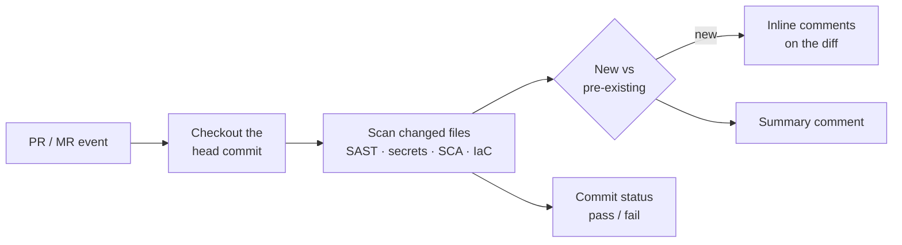

# Pull Request Review

A repository scan tells you where a codebase stands. A **pull request review** tells a developer what *this change* introduces — in the diff, before it merges — and lets you make that a required check. The platform reviews pull requests on **GitHub**, merge requests on **GitLab** (gitlab.com) and pull requests on **Bitbucket** with the same engines as a full scan.

## What a review does



1. **Exact commit.** The review checks out the commit the event names, not "the latest on the branch", so a status is always about the code it is attached to. The result records the requested and resolved commit.
2. **Changed files only.** Only files touched by the change are scanned, which is what keeps a review fast enough to sit in the merge path.
3. **New vs pre-existing.** Each finding is classified as **new** (introduced by this change) or **pre-existing** (already on the target branch). The classification ignores line numbers, so a file re-indented by the change does not turn old findings into new ones.
4. **Decoration.** New findings get **inline comments** on the affected lines, worst severity first, up to 30 per review; one **summary comment** lists everything; a **commit status** reports pass or fail. If the scan itself fails, a *failed* status is published with the reason — a review never leaves a required check pending.
5. **Findings land in the platform** too: the same rows appear under **Findings** and the scan under **Reports**, with the usual triage lifecycle.

### The gate

The pass/fail decision is made from **the review's own findings** (severity threshold and the active [SCA policy pack](./sbom-and-licenses.md#sca-policy-packs)), never from findings elsewhere in the platform. Findings you have already triaged — false positive, accepted risk — do not fail a review. Configure thresholds as described in [CI/CD & Automation](./ci-cd-and-automation.md#gating).

## GitHub

Install the **Offload Security GitHub App** ([Deeper GitHub integration](../../cli-and-cicd.md#5-deeper-github-integration-the-github-app)). The App receives pull-request events and creates a **check run** on the head commit with the inline annotations and the summary. Mark that check as a **required status check** in the repository's branch protection to block merges on a failing review. Nothing else to configure per repository.

## GitLab and Bitbucket

GitLab and Bitbucket reviews are driven by a webhook the platform gives you, authenticated by a secret only the two sides know.

**1. Connect the provider.** Under Code Command Center → Automation → **Git Connections**, connect GitLab or Bitbucket with a token that can read the repository and comment on merge/pull requests (GitLab: `read_api`, `read_repository` and `api` for comments and statuses; Bitbucket: repository read plus pull-request write).

**2. Create the review hook** (once per team and provider — needs *Manage Integrations*):

```bash
curl -s -X POST https://<your-host>/api/scm/webhooks/gitlab/secret \
  -H "Authorization: Bearer $API_KEY"
```

Use `bitbucket` in place of `gitlab` for Bitbucket. The response contains the `hook_id`, the inbound `path` and a `secret`:

```json
{ "hook_id": "3f9c…", "secret": "…", "path": "/api/scm/webhooks/gitlab/3f9c…" }
```

:::caution
The secret is shown **once**; only its hash is stored. If you lose it, create the hook again.
:::

**3. Register it on the repository.**

| Provider | Where | URL | Secret | Events |
| --- | --- | --- | --- | --- |
| **GitLab** | Project → Settings → Webhooks | `https://<your-host>` + `path` | *Secret token* = `secret` | Merge request events, Push events |
| **Bitbucket** | Repository settings → Webhooks | `https://<your-host>` + `path` | *Secret* = `secret` | `pullrequest:created`, `pullrequest:updated`, `repo:push` |

`GET /api/scm/webhooks/gitlab` (or `…/bitbucket`) confirms a hook is configured for the team.

**4. Open a merge request.** Within a minute the MR shows inline comments on new findings, a summary note and a commit status. Make the status required in the project's merge-request approval settings to block merges.

## Reading a review

| You see | It means |
| --- | --- |
| Inline comment on a line | A **new** finding introduced by this change — rule, severity, and what to do. |
| Summary comment | Counts by severity for new and pre-existing findings, the gate result, and the files that were reviewed. If the changed-file list could not be read, the whole branch was scanned and the summary says so. |
| Status **failed** with a reason | The gate failed, or the scan itself could not run (clone failure, unsupported input). The reason is in the status text. |
| No comments, status **passed** | Nothing new at or above the threshold. Pre-existing findings are listed in the summary only. |

Decisions you make on a finding from the review — false positive, accepted risk — apply to the next review of the same repository, so a known false positive does not fail every subsequent pull request. See [Findings & Reports](./findings-and-reports.md#lifecycle) for scope.

## Related

- [CI/CD & Automation](./ci-cd-and-automation.md) — scheduled scans and pipeline jobs for full scans on merge and nightly.
- [CLI & CI/CD](../../cli-and-cicd.md) — the GitHub Action alternative and the release-gate policy.
- [Scanning API](../api.md#code) — the webhook endpoints.
