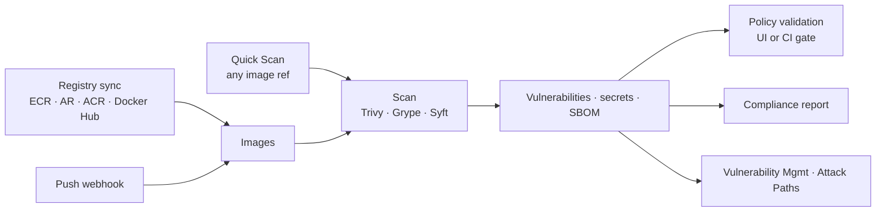

# Container Security

Container Security covers the images you build and pull: the registries they live in, the vulnerabilities and secrets inside them, the Dockerfiles that produce them, the policies that decide whether they may deploy, and the SBOMs and compliance evidence you keep about them.

**Where:** left navigation → **Container Security**.

## What you get

| Capability | Detail |
| --- | --- |
| **Registry connections** | AWS ECR, Google Artifact Registry, Azure Container Registry — using a connected cloud account or inline credentials — plus Docker Hub. Images are synced, browsed and scanned in place. |
| **Image scanning** | **Trivy** + **Grype** for OS and language-package vulnerabilities (with fix versions), **Syft** for the SBOM, secrets and misconfigurations in image layers; Quick Scan for any public image, registry scans for your own. |
| **Dockerfile scanning** | 14 native rules — root user, `latest` tags, secrets in `ENV`, `ADD` from URLs, missing `HEALTHCHECK` — graded before the image is ever built. |
| **Admission policies** | Allowed registries, maximum critical/high/medium counts, block `latest`, require signatures — validated in the UI or from CI with one call. |
| **Registry webhooks** | Push events from ECR, GCR/Artifact Registry, ACR and Docker Hub trigger an automatic scan of the new image. |
| **SBOM lifecycle** | Generate CycloneDX, SPDX or Syft JSON SBOMs per image, keep them, download them. |
| **Compliance reports** | CIS Docker Benchmark 1.6, NIST 800-53, PCI DSS and SOC 2 per image, registry or account, with a posture trend. |
| **Coverage** | Registries scanned / scheduled / uncovered / stale, same model as Cloud Security. |

## The workspace

| Tab | Use it to | Page |
| --- | --- | --- |
| **Coverage** | See registry coverage and where findings concentrate. | *this page* |
| **Cloud Registries** | Add registries, sync and browse images, scan them, review drift. | [Registries](./registries.md) |
| **Quick Scan** | Scan any image reference on demand. | [Image Scanning](./image-scanning.md) |
| **Scan Results** | Open results, read vulnerabilities and fixes, export. | [Image Scanning](./image-scanning.md#reading-a-result) |
| **Dockerfile Scan** | Paste a Dockerfile and get graded findings. | [Image Scanning](./image-scanning.md#dockerfile-scanning) |
| **Image Policies** | Define and validate admission policies. | [Policies, Webhooks, SBOM & Compliance](./governance.md#image-admission-policies) |
| **Webhooks** | Auto-scan on push. | [Policies, Webhooks, SBOM & Compliance](./governance.md#registry-webhooks) |
| **SBOM** | Generate and manage SBOMs. | [Policies, Webhooks, SBOM & Compliance](./governance.md#sbom-lifecycle) |
| **Compliance** | Generate container compliance reports. | [Policies, Webhooks, SBOM & Compliance](./governance.md#compliance-reports) |

The header shows the engine versions in use (Syft, Grype) and **Schedule Scans** opens the Unified Scheduler.

## How it flows

## Prerequisites

- **Manage Container Security** to add registries, create policies and run scans; **View Scans** to read results.
- For cloud registries: pull permission on the registry — `ecr:GetAuthorizationToken` + read (in `ReadOnlyAccess`) on AWS, `roles/artifactregistry.reader` on GCP, `AcrPull` on Azure — see [Required Permissions — Container registries](../../cloud-security/permissions.md#container-registries).

## Related

- [Kubernetes Security](../kubernetes/index.md) — the clusters those images run in.
- [Code Command Center](../code/index.md) — scan the image you just built in CI with **Compiled Image Scan**.
- [Vulnerability Management](../../vulnerability-risk/vulnerability-management/index.mdx) — SLA tracking for image CVEs.
