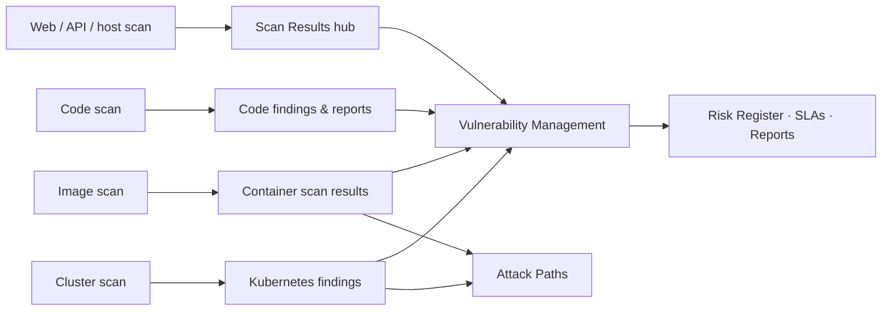

# App & Infrastructure Scanning

Cloud Security tells you how your accounts are configured. This section covers everything you **build and run** on top of them: the web apps and APIs you expose, the hosts behind them, the container images you ship, the Kubernetes clusters they run in, and the source code they came from. Each area has its own workspace, but every result becomes a finding with a severity, an affected resource and a fix, and flows into the same triage, risk and reporting pipeline.

## The five workspaces

| Workspace | Where | What you scan | Engines |
| --- | --- | --- | --- |
| **[Web, API & Host Scans](./native-scans.md)** | **Scanning** → New Scan | URLs, APIs, hosts, TLS endpoints | OWASP ZAP, Nuclei, Nmap, testssl.sh, native header / API / fingerprint analyzers |
| **[Code Command Center](./code/index.md)** | **Code Command Center** | Git repositories, uploaded archives, build artifacts | OpenGrep + Bandit (SAST), OSV.dev (SCA), Gitleaks (secrets), Checkov (IaC), Syft + Grype (SBOM / images), SonarQube |
| **[Container Security](./containers/index.md)** | **Container Security** | Images in ECR / Artifact Registry / ACR / Docker Hub, Dockerfiles | Trivy, Grype, Syft, native Dockerfile rules |
| **[Kubernetes Security](./kubernetes/index.md)** | **Kubernetes Security** | EKS / GKE / AKS / on-prem clusters | kube-bench, Polaris, Kubescape, Trivy, kube-hunter |
| **[Infra Command Center](./infra-command-center.md)** | **Infra Command Center** | CI pipelines, WAF rules, API endpoints under load | CI/CD API keys, WAF test suite, load tester |

Results from the first workspace land in the **[Scan Results hub](./scan-results.md)**; the other four keep their own results tabs and also feed the unified views.

## How it fits together

1. **Scan** — from the UI, on a schedule, or from CI (`scan.sh`, the CLI, or the API).
2. **Finding** — every engine's output is normalised, deduplicated across runs, and kept with its history; your triage decisions (resolved, false positive, suppressed) survive re-scans.
3. **Risk** — findings roll into [Vulnerability Management](../vulnerability-risk/vulnerability-management/index.mdx) for SLA tracking and into the [Risk Register](../vulnerability-risk/risk-management/index.md) when they need an owner.
4. **Report** — per-scan HTML / PDF / Word reports, consolidated reports across scans, and compliance mappings (OWASP, CIS, NIST, PCI DSS, SOC 2).

## Start here

| If you want to… | Go to |
| --- | --- |
| Test a website or API before release | [Running Web, API & Host Scans](./native-scans.md) |
| Scan a repository or wire scans into CI | [Connecting Repositories](./code/connecting-repositories.md) → [Running Code Scans](./code/running-code-scans.md) → [CI/CD & Automation](./code/ci-cd-and-automation.md) |
| Scan the images in your registries | [Registries](./containers/registries.md) → [Image Scanning](./containers/image-scanning.md) |
| Assess a cluster | [Onboarding Clusters](./kubernetes/onboarding-clusters.md) → [Scanning & Findings](./kubernetes/scanning-and-findings.md) |
| Schedule everything | [Scan Management & Scheduling](./scan-management.md) |
| Automate over REST | [Scanning API](./api.md) |

:::note[Only scan what you own]
Web, API, network and load tests send real traffic to the target. Run them only against systems you own or are explicitly authorised to test, and use the gentler scan profiles on production.
:::

## Prerequisites

- Platform permissions: **Run Scans** to start scans, **View Scans** to read results, **Manage Container Security** for registries, policies and clusters ([RBAC](../authentication/rbac-team-management.md)).
- For registries and clusters discovered from the cloud: a connected account ([Connecting Cloud Accounts](../cloud-security/connecting-accounts.md)) with the roles in [Required Permissions](../cloud-security/permissions.md).
- For repositories: a Git provider token (GitHub, GitLab or Bitbucket) with read access.
