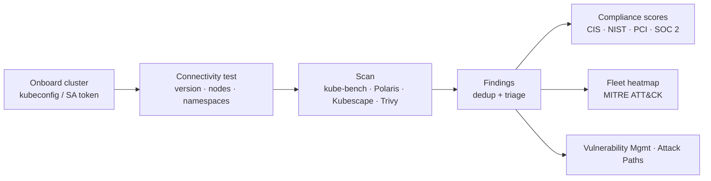

# Kubernetes Security

Kubernetes Security assesses your clusters for misconfigured control planes and nodes, risky workloads, over-permissive RBAC and vulnerable images — then shows the result per cluster, across the fleet, and mapped to the **MITRE ATT&CK Containers** matrix and to compliance frameworks. It works for managed clusters (Amazon EKS, Google GKE, Azure AKS) and on-premises Kubernetes, always with **read-only** access.

**Where:** left navigation → **Kubernetes Security**.

## What you get

| Capability | Detail |
| --- | --- |
| **Read-only onboarding** | A kubeconfig or a service-account token; managed clusters are also auto-discovered from connected cloud accounts and imported in one click. |
| **Least-privilege RBAC profiles** | Generated `ClusterRole` scripts — **Minimal** (no Secrets or ConfigMaps) or **Extended** (metadata only) — so the platform gets exactly the read access it needs. |
| **Multi-engine scans** | **kube-bench** (CIS Kubernetes Benchmark), **Polaris** (workload best practices), **Kubescape** (NSA-CISA, MITRE, CIS frameworks), **Trivy** (misconfigurations and image vulnerabilities) and **kube-hunter** (attack-surface probing). |
| **Findings with triage** | Severity, affected resource, scanner, remediation; statuses **open / resolved / suppressed / false positive** that survive re-scans. |
| **Fleet heatmap** | Every cluster by severity plus the MITRE ATT&CK container tactics your findings map to. |
| **Compliance posture** | Per-cluster scores and grades for **CIS, NIST 800-53, PCI DSS and SOC 2** (HIPAA on request), with exportable reports. |
| **Coverage** | Which clusters are scanned, scheduled, uncovered or stale — the same coverage model as Cloud Security. |

## The workspace

| Tab | Use it to | Page |
| --- | --- | --- |
| **Coverage** | See scanned / scheduled / uncovered clusters and where findings concentrate. | *this page* |
| **Clusters** | Add, import, test and scan clusters; open a cluster's dashboard. | [Onboarding Clusters](./onboarding-clusters.md) |
| **Fleet Heatmap** | Compare clusters by severity and MITRE tactic. | [Compliance & Fleet Posture](./compliance-and-fleet.md) |
| **Findings** | Filter and triage every finding across clusters. | [Scanning & Findings](./scanning-and-findings.md) |
| **Compliance** | Read per-cluster framework scores and generate reports. | [Compliance & Fleet Posture](./compliance-and-fleet.md) |
| **RBAC Profiles** | Choose the scanner's access level and generate the deployment script. | [Onboarding Clusters](./onboarding-clusters.md#rbac-profiles) |

**Schedule Scans** (top right) opens the Unified Scheduler to set recurring cluster scans — see [Scan Management & Scheduling](../scan-management.md).

## How a cluster scan flows

## Prerequisites

- **Network reachability** from the platform to the cluster API server.
- **Read-only credentials**: a kubeconfig or service-account token bound to one of the [RBAC profiles](./onboarding-clusters.md#rbac-profiles). Cloud IAM alone does not grant in-cluster read — apply the `ClusterRole` from [Required Permissions — Bucket B](../../cloud-security/permissions.md#bucket-b--kubernetes-in-cluster-rbac).
- Platform permission **Manage Container Security** to onboard and scan; **View Scans** to read.

## Related

- [Container Security](../containers/index.md) — the images running in your clusters.
- [Attack Path Analysis](../../cloud-security/attack-paths.md) — cluster findings and namespaces become nodes in the security graph.
- [Vulnerability Management](../../vulnerability-risk/vulnerability-management/index.mdx) — SLA tracking for Kubernetes findings.
