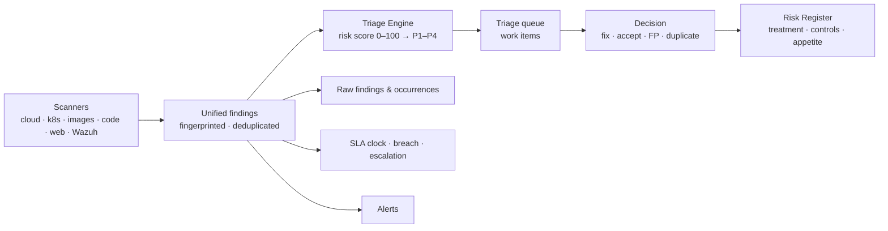

# Vulnerabilities & Risk

Scanning produces findings. This section is where findings become **decisions and work**: one queue across cloud, Kubernetes, containers, code and web scans; a risk score that ranks *exploitable, exposed, in production* ahead of *critical on paper*; SLAs and alerts that keep deadlines honest; and a Risk Register that turns the important ones into owned, treated, reported business risks.

## The four workspaces

| Workspace | Where | What it answers | Pages |
| --- | --- | --- | --- |
| **Vulnerability Management** | *Core Security* → Vulnerability Management | What do we fix first, and is it actually fixed? | [Overview](./vulnerability-management/index.mdx) · [Triage Queue](./vulnerability-management/triage.md) · [Raw Findings & Occurrences](./vulnerability-management/raw-findings.md) · [Dashboard](./vulnerability-management/dashboard.md) |
| **SLA Management** | Vulnerability Management → SLA Policies | Are we fixing things as fast as we promised? | [SLA Management](./sla-management.md) |
| **Alerts** | *Core Security* → Alerts | What just changed that someone must look at? | [Alerts](./alerts.md) |
| **Risk Management** | *Compliance & Risk* → Risk Management | Which of this is a business risk, who owns it, and is it within appetite? | [Overview](./risk-management/index.md) · [Risk Register](./risk-management/risk-register.md) · [Treatment & Controls](./risk-management/treatment-and-controls.md) · [Appetite, KRIs & Scenarios](./risk-management/appetite-kris-scenarios.md) |

## How findings flow

1. **Unify.** Every scanner's output is normalised into one finding model and **fingerprinted**, so the same weakness reported by two tools, or found again next week, is one record with history — not a duplicate.
2. **Score.** The Triage Engine gives each open finding a **risk score (0–100)** from severity, exploitability (KEV, EPSS, exploit availability), internet exposure, environment, asset criticality and scanner confidence, and buckets it **P1 Immediate → P4 Review**. Internet-exposed + exploitable + production is always P1.
3. **Decide.** Work the **Action queue** (P1 + P2) as *work items* — one check across all the resources it affects — and record a decision that survives re-scans: fixed, accepted risk, false positive, duplicate.
4. **Enforce.** **SLA policies** start a clock on every finding, flag breaches and escalate; **alerts** surface new criticals, scan failures and breaches to the channels you choose.
5. **Govern.** Promote what matters into the **Risk Register** — manually or by automatic import of high-severity findings — give it an owner and a treatment plan, test the controls, and report against **risk appetite**.

:::note[Vulnerability vs. risk]
A **finding** is a specific weakness on a specific asset. A **risk** is the business concern it represents, with an owner, a likelihood × impact rating and a plan. One risk usually covers many findings — you work the technical detail in Vulnerability Management and the business view in Risk Management.
:::

## Start here

| If you want to… | Go to |
| --- | --- |
| Clear today's must-fix list | [Triage Queue](./vulnerability-management/triage.md) |
| See every finding from one scanner or on one asset | [Raw Findings & Occurrences](./vulnerability-management/raw-findings.md) |
| Set remediation deadlines and see what is late | [SLA Management](./sla-management.md) |
| Get told when something new and critical appears | [Alerts](./alerts.md) → [Notifications](../integrations/notifications.md) |
| Put risks in front of leadership | [Risk Register](./risk-management/risk-register.md) → [Appetite, KRIs & Scenarios](./risk-management/appetite-kris-scenarios.md) |
| Automate any of it | [Vulnerabilities & Risk API](./api.md) |

## Prerequisites

- Platform permissions: **View Scans** to read; **Manage Triage** to score and decide; **Manage Risks** / **Create Risks** for the register; **Manage Alerts** to acknowledge and resolve ([RBAC](../authentication/rbac-team-management.md)).
- At least one scan completed in [Cloud Security](../cloud-security/index.md) or [App & Infrastructure Scanning](../security-scanning/index.md) — findings arrive here automatically.
