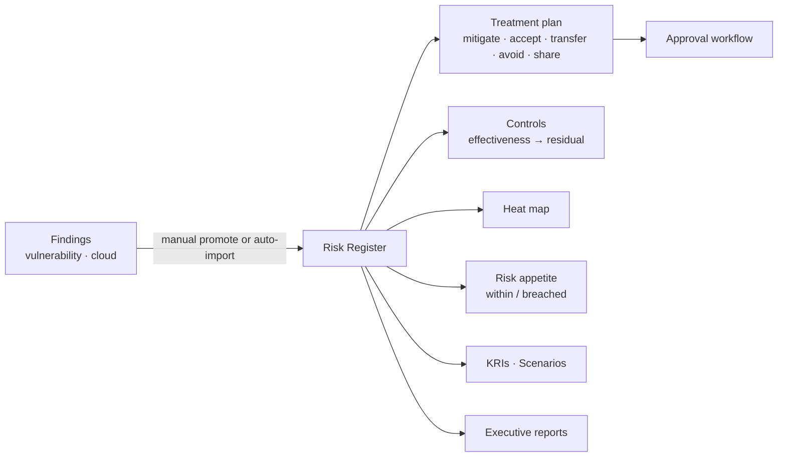

# Risk Management

Findings are technical. Leadership, auditors and regulators ask about **risk**: what could hurt the business, how likely, how badly, who owns it, what we are doing about it, and whether it is within the risk we said we would accept. Risk Management is that layer — fed by the findings you already have, expressed in the language of a risk register.

**Where:** left navigation → **Risk Management** (under *Compliance & Risk*).

## What you get

| Capability | Detail | Page |
| --- | --- | --- |
| **Risk Register** | Risks by category with owner, likelihood × impact, status and next review; grouped *by category* or listed as *all risks*. | [Risk Register](./risk-register.md) |
| **Import from Findings** | Preview and import high-severity vulnerability and cloud findings as risks, linked back to their source; also runs automatically. | [Risk Register](./risk-register.md#import-from-findings) |
| **Bulk Import / Export** | Excel / CSV template with automatic column matching; export the register. | [Risk Register](./risk-register.md#bulk-import-and-export) |
| **Treatment Plans** | Mitigate / accept / transfer / avoid / share, with actions, progress and an approval workflow. | [Treatment & Controls](./treatment-and-controls.md) |
| **Controls** | Preventive / detective / corrective / directive controls linked to risks, with design and operating effectiveness and test records. | [Treatment & Controls](./treatment-and-controls.md#controls) |
| **Heat Map** | Likelihood × impact matrix of the register. | [Treatment & Controls](./treatment-and-controls.md#heat-map) |
| **Risk Appetite** | Statement, overall tolerance, per-category appetite and thresholds. | [Appetite, KRIs & Scenarios](./appetite-kris-scenarios.md) |
| **KRIs** | Key risk indicators with green / amber / red thresholds and measurements. | [Appetite, KRIs & Scenarios](./appetite-kris-scenarios.md#key-risk-indicators) |
| **Scenarios** | What-if analysis on a risk — best case, expected, worst case, stress test. | [Appetite, KRIs & Scenarios](./appetite-kris-scenarios.md#scenarios) |
| **Reports** | Executive summary and audit report generation. | [Reports & AI](../../reports-and-ai/index.md) |

**AI Summary** (top right) narrates the current risk posture; AI assists inside forms too — auto-filling a risk from its title, recommending KRIs, generating scenarios.

## Two ways to score a risk

| Assessment | Scale | Level bands |
| --- | --- | --- |
| **Business risk** (default) | **Likelihood 1–5 × Impact 1–5 = 1–25** | ≥ 16 critical · 10–15 high · 6–9 medium · 3–5 low · below 3 very low |
| **System risk** | **Magnitude 0–100**, initial and current | ≥ 80 critical · 60–79 high · 40–59 medium · 20–39 low |

Every risk carries an **inherent** score (before controls) and a **residual** score (after the controls linked to it, weighted by their effectiveness); the dashboard's *Inherent vs Residual* panel shows the reduction per risk.

## How the pieces connect

## Prerequisites

- **View Risks** to read; **Create Risks** / **Manage Risks** to add, edit, import, treat and approve.
- Findings from any scanner ([Vulnerability Management](../vulnerability-management/index.mdx)) for import; none needed for a manual register.

## Related

- [Compliance Dashboard](../../compliance/compliance-dashboard.md) — controls here roll into the framework view.
- [Reports & AI](../../reports-and-ai/index.md) — board-level risk reporting.
