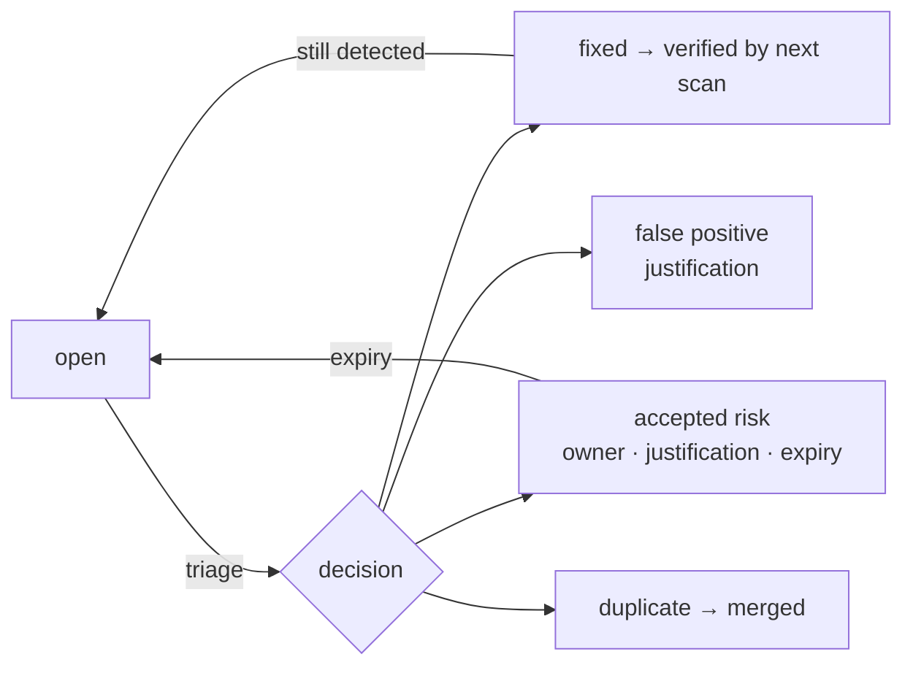

import DocFaq from '@site/src/components/DocFaq';

# Vulnerability Management

Vulnerability Management is the single place where findings from **every** source are triaged, prioritised and tracked to *verified* closure. Cloud misconfigurations, Kubernetes findings, container CVEs, web and API scan results, code findings and Wazuh detections arrive already normalised and deduplicated, so your team works one queue instead of six consoles.

**Where:** left navigation → **Vulnerability Management** (under *Core Security*).

## What arrives here

| Source filter | Fed by |
| --- | --- |
| **Cloud Misconfig** | Cloud Security posture scans (AWS / GCP / Azure) and real-time cloud events |
| **Kubernetes** | kube-bench, Polaris, Kubescape, Trivy, kube-hunter cluster scans |
| **Container CVEs** | Registry and quick-scan image results (Trivy / Grype) |
| **App Scans** | ZAP, Nuclei, Nmap, testssl, header and API tests from the Scanning workspace |
| **Code** · **IaC** | SAST, SCA, secrets and Checkov findings from the Code Command Center |
| **API** · **Domain** | API security tests and domain reconnaissance |
| **Wazuh** | Host and endpoint alerts ingested from a connected Wazuh manager |

Each source is **fingerprinted** — the same weakness on the same asset is one finding whether it came from two tools or two weeks apart — and enriched with **CISA KEV**, **EPSS**, CVSS, reachability and the asset's business context before it reaches you.

## The workspace

| Tab | What it is | Page |
| --- | --- | --- |
| **Triage** | The Triage Engine's queue: work items ranked P1–P4, the *Action queue* (P1 + P2) by default, bulk decisions, remediation guidance. | [Triage Queue](./triage.md) |
| **Raw findings** | Every unique vulnerability grouped across assets, filterable by source, severity and status; expand for description, remediation and affected assets. | [Raw Findings & Occurrences](./raw-findings.md) |
| **Dashboard** | Counts by severity and source, SLA breaches, recent vulnerabilities. | [Dashboard](./dashboard.md) |
| **All Occurrences** | The flat list — one row per finding per asset — with VPR, priority, SLA due and per-occurrence detail. | [Raw Findings & Occurrences](./raw-findings.md#all-occurrences) |
| **SLA Policies** | Remediation deadlines by severity/environment/criticality, breach dashboard, escalation. | [SLA Management](../sla-management.md) |
| **Jira** | Appears once a Jira integration is configured: tickets created from findings and their sync state. | [Third-Party Integrations](../../integrations/third-party.md) |

**Score findings** (top right of Triage) runs the Triage Engine over the team's open findings; it also runs automatically after syncs, and **Sync All Sources** pulls the latest results from every module on demand.

## The lifecycle

A finding starts **open**. Your decisions — **fixed**, **accepted risk**, **false positive**, **duplicate**, **suppressed** — are recorded on the finding and survive re-scans. When a later scan no longer reports the weakness the finding is **resolved by scan**; when a scan reports something you had marked fixed, it **reopens**. A closed Jira ticket is never treated as proof: closure is confirmed by the scanner, not the tracker.

## Prerequisites

- **View Scans** to read; **Manage Triage** to score findings and record decisions.
- Findings appear after the first scans complete in [Cloud Security](../../cloud-security/index.md) or [App & Infrastructure Scanning](../../security-scanning/index.md).

## Related

- [SLA Management](../sla-management.md) — deadlines, breaches, escalation.
- [Alerts](../alerts.md) — being told when something new needs attention.
- [Risk Management](../risk-management/index.md) — promoting findings into owned business risks.

<DocFaq items={[
  {
    q: "How should security teams deduplicate vulnerability findings?",
    a: "Offload normalizes findings from every source into a shared model and reconciles duplicates automatically, so the same issue reported by different scanners collapses into a single tracked finding in one queue.",
  },
  {
    q: "How does Offload Security prioritize vulnerabilities?",
    a: "Findings are risk-scored using exploit and threat signals such as EPSS and CISA KEV together with asset and business context, so teams focus on what is genuinely exploitable and important rather than raw CVSS alone.",
  },
  {
    q: "How do you validate vulnerability closure after a Jira ticket is resolved?",
    a: "A resolved ticket is not treated as proof a vulnerability is fixed. Offload confirms closure when a subsequent scan no longer detects the finding, so remediation is verified rather than assumed.",
  },
]} />
